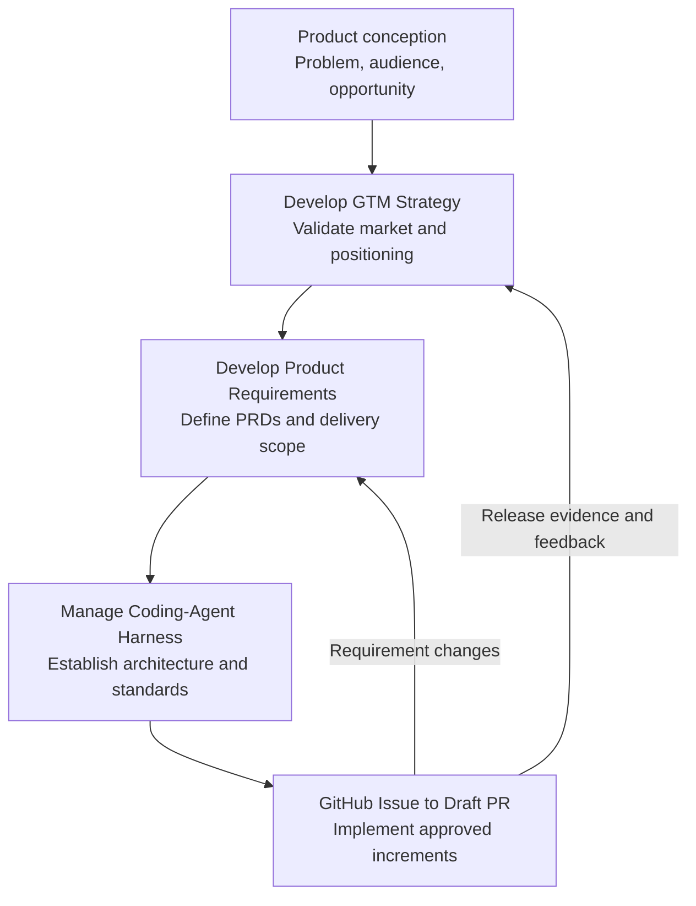

# Agent Skills

A public collection of reusable skills that teach AI agents how to follow focused, repeatable professional workflows.

The repository organizes focused workflows by professional outcome without requiring every skill to be installed together.

## Repository structure

```text
agent-skills/
├── engineering/
│   ├── README.md
│   ├── github-issue-to-draft-pr/
│   └── manage-coding-agent-harness/
├── product/
│   ├── README.md
│   ├── develop-go-to-market-strategy/
│   └── develop-product-requirements/
└── README.md
```

Each leaf directory is a self-contained skill. Install only the skill directories you need.

## Available categories

| Category | Purpose |
| --- | --- |
| [Engineering](engineering/) | Software-delivery, repository-governance, coding-agent, testing, architecture, and spec-driven-development workflows. |
| [Product](product/) | Product strategy, market selection, positioning, commercialization, launch, adoption, and evidence-based decision workflows. |

## Available skills

| Skill | Category | Purpose |
| --- | --- | --- |
| [GitHub Issue to Draft PR](engineering/github-issue-to-draft-pr/) | Engineering | Creates a GitHub issue and feature branch, pauses for approval, and then implements the approved work as a linked draft pull request. |
| [Manage Coding-Agent Harness](engineering/manage-coding-agent-harness/) | Engineering | Creates and manages technology-neutral coding-agent harnesses for existing repositories or greenfield projects described by a PRD. |
| [Develop Go-to-Market Strategy](product/develop-go-to-market-strategy/) | Product | Develops evidence-based segmentation, positioning, offers, motions, channels, launch plans, experiments, and measurable GTM priorities. |
| [Develop Product Requirements](product/develop-product-requirements/) | Product | Develops hierarchical, traceable PRDs and approved issue-decomposition plans across products, subproducts, repositories, and GitHub delivery work. |


## From product conception to delivery

These skills can be used independently or together as an end-to-end product-development system. The lifecycle is iterative rather than strictly linear: market evidence informs requirements, requirements establish engineering needs, delivery produces new evidence, and that evidence may change the go-to-market strategy or product scope.



| Lifecycle stage | Primary skill | Outcome |
| --- | --- | --- |
| Opportunity discovery | [Develop Go-to-Market Strategy](product/develop-go-to-market-strategy/) | ICP, problem evidence, positioning, offer, and market hypotheses. |
| Product definition | [Develop Product Requirements](product/develop-product-requirements/) | Product hierarchy, PRDs, requirements, acceptance criteria, and issue-decomposition plans. |
| Engineering readiness | [Manage Coding-Agent Harness](engineering/manage-coding-agent-harness/) | Stack decisions, architecture guidance, standards, repository instructions, and validation requirements. |
| Incremental delivery | [GitHub Issue to Draft PR](engineering/github-issue-to-draft-pr/) | Approved issue, feature branch, implementation, validation, and linked draft pull request. |
| Launch and learning | [Develop Go-to-Market Strategy](product/develop-go-to-market-strategy/) and [Develop Product Requirements](product/develop-product-requirements/) | Launch experiments and evidence translated into strategy or requirement changes. |

The skills support both greenfield and existing-product work:

- A product concept or existing product can begin with market and customer evidence.
- One platform may contain multiple products or subproducts, each with its own PRD.
- A greenfield project PRD can provide the foundation for creating a coding-agent harness.
- One PRD may decompose into multiple approved GitHub issues across one or more repositories.
- Each approved issue can move independently through implementation and draft-PR review.
- Launch results, delivery discoveries, and customer feedback can trigger GTM changes, PRD changes, or additional delivery work.

## Compatibility

Skills use a `SKILL.md` entry point and follow the open Agent Skills structure whenever practical.

- **ChatGPT Work:** Use the skill through a supported Skills workflow or an installable OpenAI plugin. GitHub access requires a separately authorized GitHub plugin.
- **Codex:** Install skills personally under `~/.agents/skills/` or within a project under `.agents/skills/`.
- **Claude Code:** Install skills personally under `~/.claude/skills/` or within a project under `.claude/skills/`.

A skill may also contain platform-specific metadata. For example, `agents/openai.yaml` configures its OpenAI presentation and invocation behavior without changing the shared `SKILL.md` workflow.

See each skill's README for exact prerequisites, installation commands, invocation syntax, and platform notes.

## Versioning and updates

An installed skill is a snapshot of its source at installation time. Source changes do not automatically replace installed copies, except when a host is intentionally using a symbolic link to a local checkout.

- Use the `main` branch for the latest stable skill source.
- Use Git tags and GitHub releases when an installation must remain reproducible.
- Treat updates as explicit operations so users can review workflow or permission changes before adopting them.
- Compare an installed copy with the new source before replacement when it may contain local customizations.
- Keep version information in repository tags and release notes. Keep `SKILL.md` frontmatter limited to the supported `name` and `description` fields.

For ChatGPT Work, ask ChatGPT to update the installed skill from the same source URL:

```text
Update my installed <skill-name> skill from:
https://github.com/vladicaster/agent-skills/tree/main/<category>/<skill-name>
```

ChatGPT should retrieve the current source, validate the complete skill directory, identify meaningful changes or local conflicts, and replace the installed copy. Refresh or reopen the Skills page if the updated skill is not immediately visible.

For Codex or Claude Code, pull the source checkout. Symbolic-link installations immediately use the updated checkout; copied installations must be copied again after the pull. See each skill README for exact commands.

## Design principles

Every skill should:

- Solve one recognizable workflow.
- Define when it should and should not be used.
- Make required inputs and expected outputs explicit.
- Preserve human approval gates for consequential actions.
- State permission, authentication, and tool prerequisites without embedding credentials.
- Report checks and failures honestly.
- Keep `SKILL.md` focused and place optional supporting material in `references/`, `scripts/`, or `assets/`.
- Avoid organization-specific assumptions unless the skill is intentionally organization-specific.

## Using a skill

1. Open the desired category and skill directory.
2. Read its `README.md` for platform-specific installation instructions.
3. Install the complete skill directory, keeping `SKILL.md` and its supporting files together.
4. Configure any required connectors, command-line tools, or repository permissions separately.
5. Test the skill in a non-critical repository before relying on it for production work.

## Contributing

Contributions are welcome through GitHub issues and pull requests.

When proposing a skill:

1. Place it under the category that best describes its primary outcome.
2. Use a concise, lowercase, hyphenated directory name.
3. Include a valid `SKILL.md` with clear `name` and `description` frontmatter.
4. Include a skill-level `README.md` covering purpose, prerequisites, installation, invocation, and limitations.
5. Keep examples generic and remove credentials, personal data, client information, proprietary code, and private repository references.
6. Describe how the skill was tested.
7. Preserve explicit approval gates around writes, deployments, merges, external communications, and other consequential actions.

Repository maintainers review and merge contributions. Public visibility does not grant direct write access.
