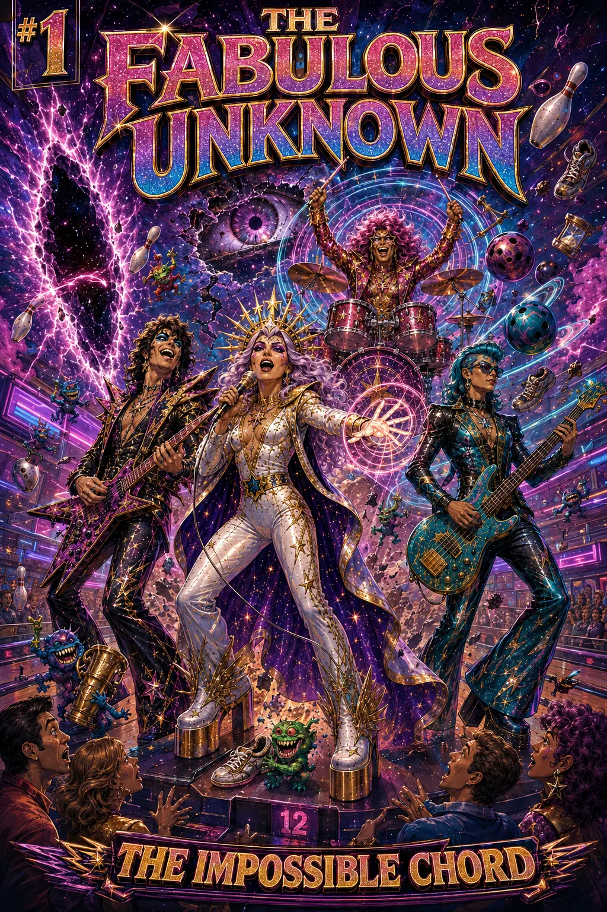
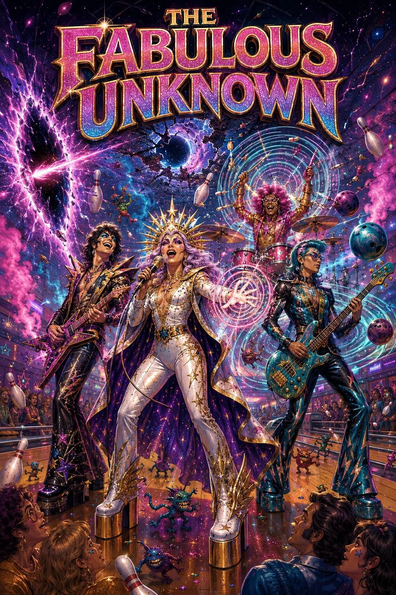
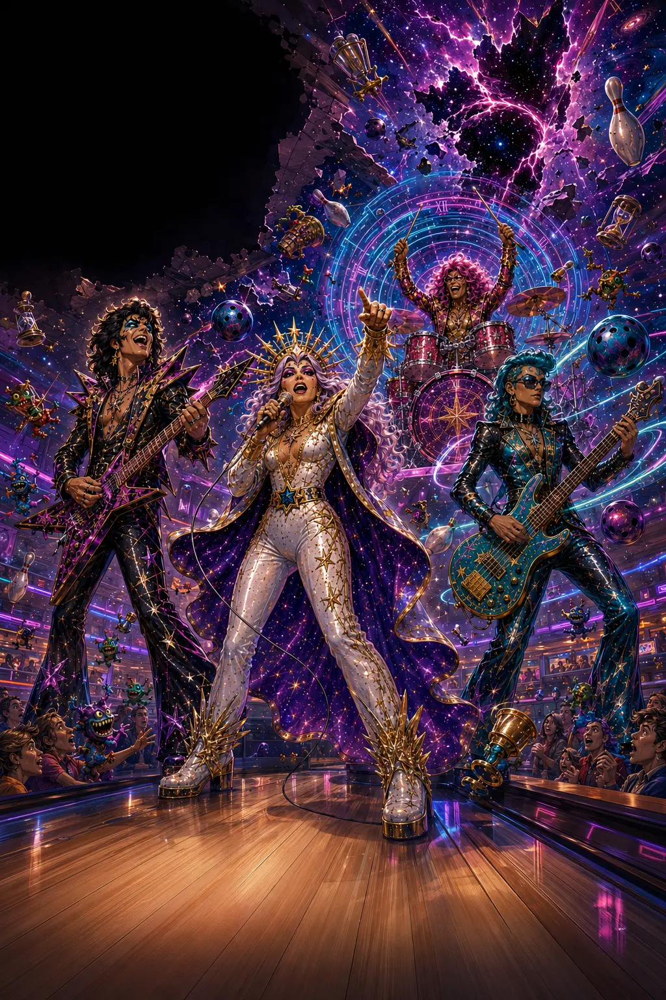
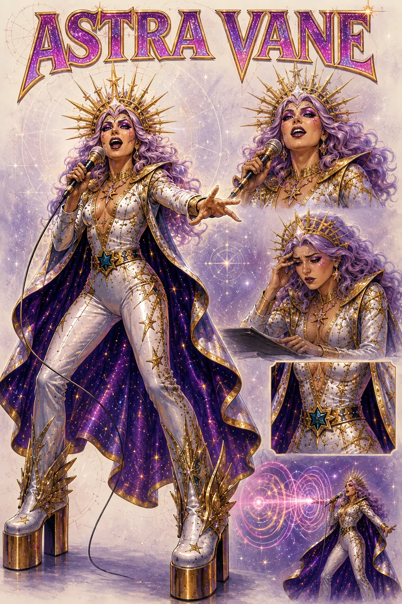
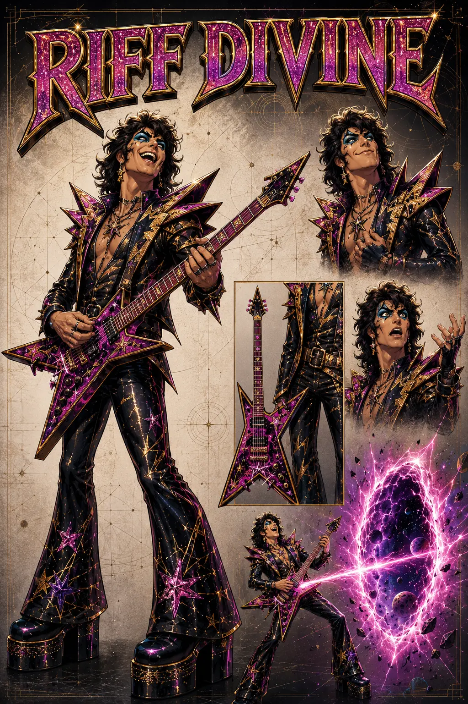
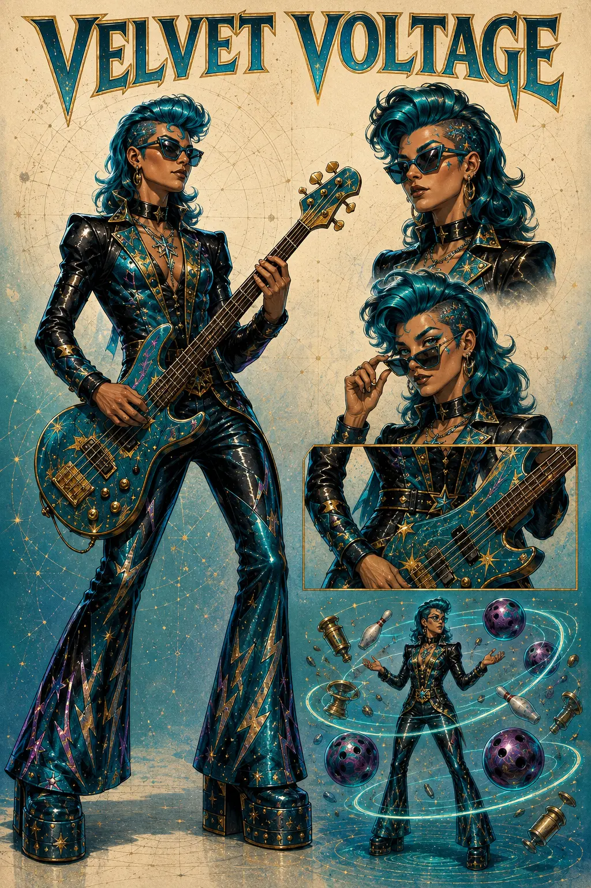
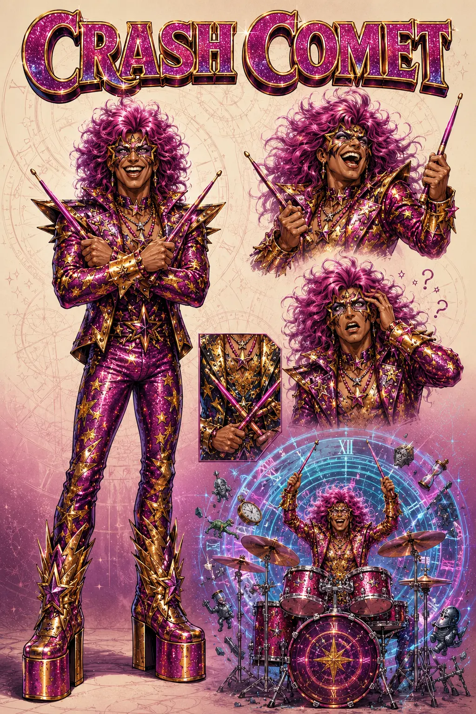

# The Fabulous Unknown

A worked example showing how `develop-creative-worlds` can turn a one-sentence premise into a canon-controlled, visually coherent graphic-novel package.

> A fictional rock band in 2027 that are also superheroes.

The example began as a casual conversation. It became a funny glam-rock superhero world, a four-person ensemble, a causally connected power system, an Episode 1 comic script, a cover, a finished splash page, and four character sheets.



## What this sample demonstrates

The skill did not begin by generating an encyclopedia or asking for an exhaustive questionnaire. It established the creative direction through a sequence of consequential choices:

1. Explore genuinely different interpretations of the premise.
2. Select a tone and musical identity.
3. Promote only explicitly approved choices into canon.
4. Develop a power system that reinforces the story's emotional theme.
5. Build characters whose personalities, instruments, and abilities generate conflict.
6. Convert the approved material into a complete Episode 1 story.
7. Use separate image and document capabilities to present the world visually and durably.

The result illustrates the skill's central principle: build worlds that generate stories instead of merely accumulating lore.

## Starting point

The initial premise contained only three facts:

- the story takes place in 2027;
- the protagonists are a rock band;
- the band members are superheroes.

Everything else began as a possibility. The skill first offered distinct creative engines:

| Possibility | Creative consequence |
| --- | --- |
| Music creates the powers | Concerts become both performances and dangerous power events. |
| Superheroes hide inside a touring band | Fame makes the team's secret identities harder to preserve. |
| Public celebrity superheroes | Heroism, branding, sponsorship, and authenticity collide. |

The selected direction combined music-generated powers with public consequences, then chose a funny rock-and-roll tone instead of a grim or satirical one.

## Canon grew through explicit choices

The user approved each consequential decision before it became authoritative.

| Decision | Status before selection | Approved canon |
| --- | --- | --- |
| Tone | Four possibilities | Funny rock-and-roll adventure |
| Musical identity | Five possibilities | Theatrical glam rock |
| Band name | Six possibilities | The Fabulous Unknown |
| Lineup | Proposed ensemble | Astra Vane, Riff Divine, Velvet Voltage, and Crash Comet |
| Origin | Three possibilities | The Impossible Chord |
| Cosmic sender | Three possibilities | Unknown; deliberately unresolved |

This sequence demonstrates the difference between fluid brainstorming and canon management. Rejected possibilities were not silently blended into the world. The unresolved sender remained Unknown because revealing it was not necessary to complete Episode 1.

## The world's creative engine

The Impossible Chord connects premise, theme, character, action, and comedy.

It can only be produced when all four musicians genuinely listen to one another. Technical accuracy alone is insufficient. Each member controls a different force through their musical role:

| Character | Instrument | Power | Personality pressure |
| --- | --- | --- | --- |
| Astra Vane | Voice | Sung commands alter people, objects, and physical forces | Her metaphors may become dangerously literal. |
| Riff Divine | Guitar | Solos cut through space and release cosmic energy | Showing off destabilizes the band's combined effect. |
| Velvet Voltage | Bass | Frequencies manipulate gravity and mass | Her control makes her the group's practical anchor. |
| Crash Comet | Drums | Tempo accelerates, slows, or disrupts time | Enthusiasm and missed beats produce temporal accidents. |

The rule creates action while expressing the story's emotional promise: four incompatible performers can become heroes only by learning to listen.

## Skill modes used

### Explore

The skill generated a small set of meaningfully different directions for the premise, tone, genre presentation, name, and origin. Each choice changed the likely story engine rather than merely changing decoration.

### Develop

After selection, the skill connected:

- stage personas to private vulnerabilities;
- instruments to distinct physical forces;
- power mechanics to band relationships;
- fame to lawsuits, audience footage, and public identity;
- the bowling-alley location to specific visual comedy;
- the Impossible Chord to both the team's strength and its central weakness.

### Document

The established material was converted into:

- a logline and visual language;
- a canon register and continuity notes;
- a principal cast;
- a complete 20-page comic script;
- a portable Markdown artifact;
- a visual reference set.

The full script is available in [episode-one-script.md](episode-one-script.md).

## Story output

Episode 1, “The Impossible Chord,” begins with the powered band already fighting a spectacular bowling-alley catastrophe. It then returns to the ordinary problems that brought them there: unpaid bills, incompatible personalities, an unreliable manager, and a humiliating booking.

During the performance, the musicians briefly stop competing and create a chord that should not exist. The chord transforms their stage personas into superhuman identities, opens a rupture above lane twelve, and releases tiny interdimensional thieves. Their individual powers initially make the crisis worse. They succeed only when they begin listening again.

The issue ends with the incident going viral, an enormous damages claim, and a message appearing on Crash Comet's bass drum:

> YOU PLAYED OUR CHORD.

The sender remains intentionally Unknown.

## Visual development

### Original concept poster

The first image established the group silhouette, bowling-alley origin, color palette, instruments, platform boots, and funny cosmic scale.



### Finished Page 1 splash

The interior splash reframed the same event as a story moment with space reserved for later lettering.



### Character sheets

The sheets preserve recognizable faces, costumes, instruments, expressions, and power effects across future illustrations.

#### Astra Vane



#### Riff Divine



#### Velvet Voltage



#### Crash Comet



## What the worldbuilding skill did—and did not do

`develop-creative-worlds` owned the creative workflow:

- alternative exploration;
- recommendation and tradeoff framing;
- explicit canon promotion;
- causal world development;
- character, power, and story-engine integration;
- continuity protection;
- transformation of approved material into a narratively useful Episode 1 plan and script.

Image generation was a separate, optional capability. It translated approved canon into visual references. The character sheets then became constraints for later images, helping preserve identity and costume continuity.

Google Docs authoring was also a separate, optional capability. It provided a connected, shareable destination for the script and images. The worldbuilding skill did not treat conversational ideation as authorization to write or publish externally; that happened only after an explicit request.

Neither capability is required to use `develop-creative-worlds`. The same workflow can finish as a conversation, Markdown file, world bible, or another portable artifact.

## Reproduce the workflow

Start with a compact premise and keep early material non-canonical:

```text
Use @develop-creative-worlds in Explore mode.

My premise is: <one-sentence world idea>.

Offer three genuinely different directions. Explain each direction's
emotional character, story engine, opportunities, difficulties, and risks.
Keep everything as a possibility until I explicitly approve it as canon.
```

After choosing a direction:

```text
Move into Develop mode. Establish the smallest set of interconnected rules
that makes this world distinctive. Trace their consequences for ordinary
life, power, identity, relationships, resources, and conflict. Propose
characters whose desires and weaknesses interact with those rules.
```

When the world is ready to preserve:

```text
Move into Document mode. Separate Canon, Proposed, Unknown, Disputed, and
Deprecated material. Create the smallest durable world bible or story package
that supports the next creative step. Do not fill unused sections.
```

Request images, connected-document writes, repository changes, or publication separately. Those actions require their own capabilities, destinations, permissions, and approval boundaries.

## What this sample does not prove

- A coherent sample does not guarantee audience comprehension or commercial appeal.
- Generated character art still benefits from a human art director and consistency review.
- A complete comic script is not the same as a lettered, print-ready comic.
- The repository validator can verify structure and links, not creative quality or originality.
- Intentional mysteries should not be “fixed” merely because they remain unexplained.
