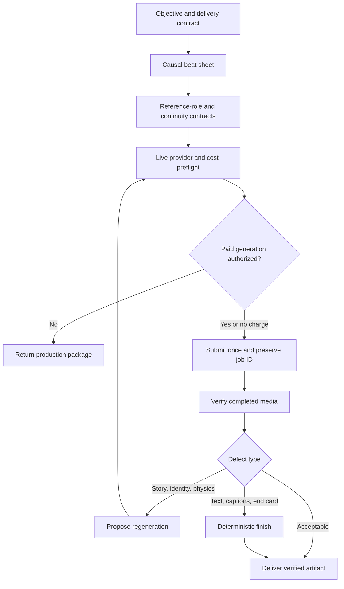

# Produce Reference-Driven Video

Plan, generate, adapt, review, and finish short AI videos whose story and visual continuity are grounded in deliberate reference media. The skill combines provider-neutral production discipline with a first-class Higgsfield and Seedance adapter.

## Purpose

Use this skill to:

- turn a product, promotional, social, or narrative objective into a causal beat sheet;
- plan reference frames instead of treating uploads as an unordered mood board;
- preserve character, wardrobe, location, prop, and brand continuity;
- generate native landscape and vertical versions of the same story;
- preflight live model capabilities, workspace balance, and expected credit cost;
- track provider jobs without duplicate submissions;
- review physical interactions, identity, geography, audio, spelling, and platform fit;
- repair captions, end cards, and exact typography deterministically.

The skill is useful for hero videos, Reels, Shorts, product stories, local-business ads, and other compact multi-scene productions. It is not a general nonlinear editor or a promise that a generative model will produce final typography accurately.

## When to use it

Recognizable requests include:

- “Turn these four reference images into a 16:9 hero video.”
- “Make a native 9:16 version for Reels and Shorts.”
- “Keep the same owner, customer, shop, wardrobe, and story across every shot.”
- “Generate this in Higgsfield with Seedance 2.0 or 2.5.”
- “Check the status without starting another generation.”
- “The video is good, but the final word is misspelled—repair it without spending more credits.”

Do not use it as the primary workflow for a faceless narrator-led documentary, a feature-length edit, live streaming, publishing to social platforms, or licensing music and likenesses. Those require separate workflows and permissions.

## Operating modes

| Mode | Outcome |
| --- | --- |
| Concept | Audience, promise, tone, platform, call to action, and causal beat sheet |
| Reference Plan | Asset-role map and continuity invariants |
| Generate | Live provider preflight, approved submission, job record, and accessible result |
| Adapt | Native recomposition for a new ratio, duration, or platform |
| Review | Classified defects and the least expensive valid repair path |
| Finish | Deterministic captions, end card, overlays, or simple timing repair |

## Workflow



### 1. Establish the contract

Capture audience, platform, aspect ratio, resolution, duration, audio, exact copy, brand constraints, references, provider preference, destination, and cost limit. A multi-shot video receives a beat sheet before it receives a model prompt.

### 2. Make cause and geography visible

Each beat states what viewers see, what changes, why it changes, which reference controls it, and what remains invariant. A remote discovery scene must look unmistakably separate from the destination; arrival follows discovery rather than appearing to precede it.

### 3. Assign reference roles

Every image, video, and audio asset receives a declared role such as identity, location, start frame, end frame, motion, composition, style, or voice. The continuity contract records faces, wardrobe, facade and interior geometry, props, light, logos, and permitted sign behavior.

### 4. Preflight and approve generation

Model availability and price change. Query the selected provider for the current workspace, model catalog, accepted settings, reference constraints, balance, and cost. Show the proposed run before a chargeable submission and obtain approval unless the user's current request already authorized that exact run within a known budget.

### 5. Submit once and track the real job

Preserve the job ID, settings, reference map, prompt revision, cost, and status. Do not start another paid job because a preview is delayed. Distinguish generation from media delivery and return the actual artifact when available.

### 6. Review, repair, and adapt

Review story causality, geography, continuity, physical contact, doors and hinges, audio, pronunciation, exact copy, safe zones, and output format. Regenerate only when the visual story is broken. Repair typography and end cards deterministically. Recompose vertical and landscape versions natively instead of cropping.

## Higgsfield and Seedance support

[`references/higgsfield-seedance.md`](references/higgsfield-seedance.md) is a first-class adapter for Higgsfield. It requires live workspace, balance, model, mode, and cost discovery; covers Seedance 2.0 and 2.5 without assuming either is available; assigns start/end/image/video/audio references; preserves generation job IDs; reuses completed work; and uses an available Higgsfield sandbox or FFmpeg path for deterministic repairs.

Installing this skill does not install or connect Higgsfield. Provider access, credentials, workspace selection, media uploads, and paid generation remain separately authorized capabilities.

## Included resources

- [`references/prompt-patterns.md`](references/prompt-patterns.md) contains causal story, reference-role, continuity, physical-interaction, audio, and aspect-ratio patterns.
- [`references/quality-checklist.md`](references/quality-checklist.md) covers story, geography, identity, physics, audio, typography, safe areas, format, and delivery.
- [`references/higgsfield-seedance.md`](references/higgsfield-seedance.md) defines the Higgsfield/Seedance execution adapter.
- [`scripts/finish_video.py`](scripts/finish_video.py) builds or executes a deterministic FFmpeg caption/end-card command.
- [`scripts/test_finish_video.py`](scripts/test_finish_video.py) tests parsing, escaping, command construction, and required-work validation.

## Deterministic finishing utility

Dry-run a command before touching media:

```bash
python creative/produce-reference-driven-video/scripts/finish_video.py \
  input.mp4 output.mp4 \
  --caption '0,2.5,Find what matters nearby' \
  --end-card-text 'Example.ai' \
  --end-card-start 5.5 \
  --dry-run
```

Remove `--dry-run` to execute. FFmpeg and the input file must be available. The utility re-encodes video with H.264, copies the existing audio stream, and does not verify brand approval, caption timing against speech, licensed font availability, or platform upload behavior.

## Approval and permission boundaries

Concept work, reference planning, read-only review, and dry-run command construction do not authorize:

- uploading private media to a provider;
- spending generation credits or changing a subscription;
- replacing source media;
- publishing or sharing externally;
- licensing a likeness, voice, font, image, or music track;
- writing production artifacts to GitHub or a connected document.

Each consequential action requires explicit authorization and the relevant connector, account, or filesystem permission. Exact provider status and cost must come from live evidence. Never embed credentials, private URLs, account identifiers, job IDs, or customer assets in reusable examples.

## Validation

From the repository root, run:

```bash
python scripts/validate_repository.py
python -m unittest discover -s creative/produce-reference-driven-video/scripts -p 'test_*.py'
python creative/produce-reference-driven-video/scripts/finish_video.py \
  sample.mp4 finished.mp4 --caption '0,2,Exact text' --dry-run
```

The repository validator checks structure, frontmatter, catalog links, Python syntax, and escaped-newline mistakes. Unit tests check the deterministic command builder. A dry run checks argument handling and shows the exact FFmpeg command. These checks do not prove that provider claims are current, generated motion is plausible, audio timing is correct, or the creative work is effective.

## Installation

Install the complete `creative/produce-reference-driven-video` directory so its references, metadata, scripts, and tests remain together.

Source:

```text
https://github.com/vladicaster/agent-skills/tree/main/creative/produce-reference-driven-video
```

### ChatGPT Work

Ask ChatGPT Work:

```text
Install the produce-reference-driven-video skill from:
https://github.com/vladicaster/agent-skills/tree/main/creative/produce-reference-driven-video
```

The host should retrieve and validate the complete directory. Installing the skill grants no Higgsfield, GitHub, filesystem, publishing, or spending permission.

### Codex

```bash
mkdir -p ~/.agents/skills
cp -R creative/produce-reference-driven-video ~/.agents/skills/produce-reference-driven-video
```

For a project installation, copy the directory to `.agents/skills/produce-reference-driven-video` instead.

### Claude Code

```bash
mkdir -p ~/.claude/skills
cp -R creative/produce-reference-driven-video ~/.claude/skills/produce-reference-driven-video
```

For a project installation, copy the directory to `.claude/skills/produce-reference-driven-video` instead. An absolute symbolic link may be used when an installation should follow a maintained source checkout; a copied installation is a snapshot.

## Invocation

```text
Use @produce-reference-driven-video to turn these reference frames into a 9:16 social video. Establish the customer away from the destination, preserve both characters and the location, preflight Higgsfield Seedance, and ask before spending credits.
```

The skill may trigger implicitly when the host supports it and the request closely matches the description.

## Updating this skill

For ChatGPT Work, ask:

```text
Update my installed produce-reference-driven-video skill from:
https://github.com/vladicaster/agent-skills/tree/main/creative/produce-reference-driven-video
```

For Codex or Claude Code, pull the source checkout and then replace copied installations after reviewing local changes. Symbolic links follow the source checkout automatically. Use a repository tag or commit for reproducible installations. `main` is the latest stable source, not a permanent pin.

## Limitations

- Provider tools, credits, model names, and capabilities can change and require live discovery.
- Reference-driven generation reduces but does not eliminate identity, geometry, motion, or audio defects.
- Deterministic typography still requires human spelling, timing, safe-area, and brand review.
- Vertical and landscape adaptations may require separate paid generations.
- Legal, likeness, music, trademark, and platform-policy review remain human responsibilities.
- The skill does not publish content or purchase credits.
- GitHub is unnecessary unless the user requests repository-backed storage or delivery.
