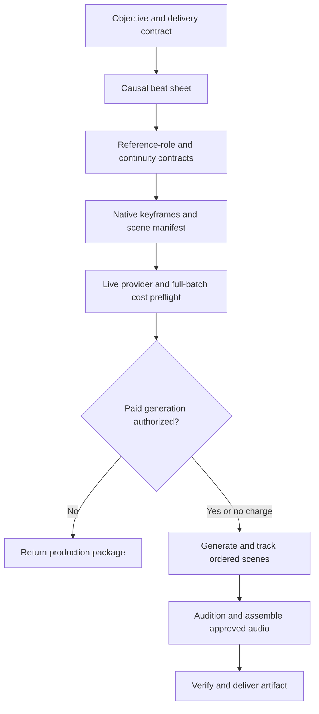

# Produce Reference-Driven Video

Plan, generate, adapt, review, and finish short AI videos whose story and visual continuity are grounded in deliberate reference media. The skill combines provider-neutral production discipline with a first-class Higgsfield and Seedance adapter.

## Purpose

Use this skill to:

- turn a product, promotional, social, or narrative objective into a causal beat sheet;
- plan reference frames instead of treating uploads as an unordered mood board;
- convert storyboard panels into standalone native-ratio scene keyframes before generation;
- preserve character, wardrobe, location, prop, and brand continuity;
- generate native landscape and vertical versions of the same story;
- preflight live model capabilities, workspace balance, and expected credit cost;
- track provider jobs without duplicate submissions;
- generate strict timelines as ordered per-scene clips when a provider cannot guarantee multi-reference chronology;
- paginate voice catalogs, audition subjective voice choices, and preserve exact voice identifiers;
- audition music separately, approve cue and prominence independently, and preserve soundtrack revision lineage;
- review physical interactions, identity, geography, audio, spelling, and platform fit;
- keep exact narration independently replaceable, reconcile narration and visual duration without unnecessary regeneration, and repair transcription-timed captions, end cards, typography, and background-music mixes deterministically.

The skill is useful for hero videos, Reels, Shorts, product stories, local-business ads, and other compact multi-scene productions. It is not a general nonlinear editor or a promise that a generative model will produce final typography accurately.

## When to use it

Recognizable requests include:

- “Turn these four reference images into a 16:9 hero video.”
- “Make a native 9:16 version for Reels and Shorts.”
- “Keep the same owner, customer, shop, wardrobe, and story across every shot.”
- “Generate this in Higgsfield with Seedance 2.0 or 2.5.”
- “Check the status without starting another generation.”
- “The video is good, but the final word is misspelled—repair it without spending more credits.”

Do not use it as the primary workflow for a faceless narrator-led documentary, a feature-length edit, live streaming, publishing to social platforms, or licensing music and likenesses. Those require separate workflows and permissions.

## Operating modes

| Mode | Outcome |
| --- | --- |
| Concept | Audience, promise, tone, platform, call to action, and causal beat sheet |
| Reference Plan | Asset-role map and continuity invariants |
| Generate | Live provider preflight, approved submission, job record, and accessible result |
| Adapt | Native recomposition for a new ratio, duration, or platform |
| Review | Classified defects and the least expensive valid repair path |
| Finish | Deterministic captions, end card, overlays, background music, or simple timing repair |

## Workflow



### 1. Establish the contract

Capture audience, platform, aspect ratio, resolution, duration, audio, exact copy, brand constraints, references, provider preference, destination, and cost limit. Confirm whether the user wants burned-in captions or subtitles; if unspecified, ask rather than assuming. A multi-shot video receives a beat sheet before it receives a model prompt.

### 2. Make cause and geography visible

Each beat states what viewers see, what changes, why it changes, which reference controls it, and what remains invariant. A remote discovery scene must look unmistakably separate from the destination; arrival follows discovery rather than appearing to precede it.

### 3. Assign reference roles

Every image, video, and audio asset receives a declared role such as identity, location, start frame, end frame, motion, composition, style, or voice. The continuity contract records faces, wardrobe, facade and interior geometry, props, light, logos, and permitted sign behavior.

A storyboard or contact sheet remains a planning artifact. Each generated scene receives its own independently usable reference composed at the delivery ratio. For strict chronology, preserve an ordered scene manifest and generate separate clips when the provider cannot guarantee multi-reference sequencing.

### 4. Preflight and approve generation

Model availability and price change. Query the selected provider for the current workspace, model catalog, accepted settings, reference constraints, balance, and cost. Quote the complete batch, not only a representative clip. Show the proposed run before a chargeable submission and obtain approval unless the user's current request already authorized that exact run within a known budget.

### 5. Submit once and track the real job

Preserve the job ID, settings, reference map, prompt revision, cost, and status. Do not start another paid job because a preview is delayed. Distinguish generation from media delivery and return the actual artifact when available.

### 6. Assemble, review, repair, and adapt

When narration must be exact or editable, generate silent visual clips and create the selected voice separately. Search paginated catalogs to resolve the exact voice identifier. A voice name identifies a catalog entry but does not prove that its tone is right; when tone is subjective, use a separately priced and approved short audition before the full read. A copy or voice revision creates a new narration asset and rebuilt master, not automatically new visual generations, and rejected audio never enters later assembly.

Measure the final narration against the visual runtime. Prefer modest visual retiming and a brief final-frame hold over paid regeneration when motion remains natural. When music is requested, offer materially distinct tonal directions, audition an undecided cue by itself, and approve cue identity separately from prominence. Preserve the approved narrated master, record music provenance and licensing state, then create separately named mixes with duration matching, intentional fades, narration-aware ducking, and limiting. Descriptive levels such as subtle, balanced, and prominent are creative targets calibrated to the current assets, not fixed gain constants.

When the approved contract includes subtitles, derive them from fresh transcription of the final audio or video, using authored copy only to correct words while retaining audio-based timestamps. Use word timestamps for caption boundaries inside larger transcription segments. Captions are optional and are not implied by the presence of narration. Review story causality, geography, continuity, physical contact, doors and hinges, audio, pronunciation, exact copy, safe zones, and output format. Regenerate only when the visual story is broken. Repair typography, end cards, and replaceable audio deterministically. Recompose vertical and landscape versions natively instead of cropping.

The production is complete only after confirming the final duration, dimensions, frame rate, codecs and streams, exact copy, subtitle and end-card layout, upload or save result, accessibility of the delivered revision, and a direct download path when the host provides one.

## Higgsfield and Seedance support

[`references/higgsfield-seedance.md`](references/higgsfield-seedance.md) is a first-class adapter for Higgsfield. It requires live workspace, balance, model, mode, and full-batch cost discovery; covers Seedance 2.0 and 2.5 without assuming either is available; validates native scene references; preserves ordered batch records and generation job IDs; keeps narration replaceable; reuses completed work; and uses an available Higgsfield sandbox or FFmpeg path for deterministic assembly and repairs.

Installing this skill does not install or connect Higgsfield. Provider access, credentials, workspace selection, media uploads, and paid generation remain separately authorized capabilities.

## Included resources

- [`references/prompt-patterns.md`](references/prompt-patterns.md) contains causal story, reference-role, ordered-scene, continuity, physical-interaction, audio, and aspect-ratio patterns.
- [`references/quality-checklist.md`](references/quality-checklist.md) covers story, native references, geography, identity, physics, audio revision state, transcription-timed captions, typography, safe areas, format, and delivery.
- [`references/higgsfield-seedance.md`](references/higgsfield-seedance.md) defines the Higgsfield/Seedance execution adapter.
- [`scripts/finish_video.py`](scripts/finish_video.py) builds or executes a deterministic FFmpeg caption/end-card command.
- [`scripts/test_finish_video.py`](scripts/test_finish_video.py) tests parsing, escaping, command construction, and required-work validation.
- [`scripts/mix_background_music.py`](scripts/mix_background_music.py) builds or executes a source-preserving FFmpeg mix with cue-specific gain, fades, narration ducking, and limiting.
- [`scripts/test_mix_background_music.py`](scripts/test_mix_background_music.py) tests source preservation, gain and fade construction, ducking, limiting, and invalid inputs.

## Deterministic finishing utility

Dry-run a command before touching media:

```bash
python creative/produce-reference-driven-video/scripts/finish_video.py \
  input.mp4 output.mp4 \
  --caption '0,2.5,Find what matters nearby' \
  --end-card-text 'Example.ai' \
  --end-card-start 5.5 \
  --dry-run
```

Remove `--dry-run` to execute. FFmpeg and the input file must be available. The utility re-encodes video with H.264 and copies the existing audio stream. It accepts caption windows only when their timings already come from a valid external source; it does not transcribe speech. Use an available dedicated subtitle workflow for narration-driven captions so timings come from the final audio or video. The utility does not verify brand approval, licensed font availability, or platform upload behavior.

For an approved, duration-matched music cue, dry-run a new candidate mix without overwriting the narrated master:

```bash
python creative/produce-reference-driven-video/scripts/mix_background_music.py \
  approved-master.mp4 approved-cue.m4a candidate-mix.mp4 \
  --duration 18.4 --music-gain 0.3 --fade-in 1.2 --fade-out 1.5 \
  --dry-run
```

Remove `--dry-run` only after checking the paths and cue-specific settings. The helper copies the video stream, encodes a new AAC mix, ducks music beneath the existing narration, and limits the combined output. It does not choose a musical direction, define universal prominence levels, prove speech intelligibility or loudness compliance, verify cue duration, or grant music licensing.

## Approval and permission boundaries

Concept work, reference planning, read-only review, and dry-run command construction do not authorize:

- uploading private media to a provider;
- spending generation credits or changing a subscription;
- replacing source media;
- publishing or sharing externally;
- licensing a likeness, voice, font, image, or music track;
- generating or licensing a new music cue, even when earlier video or voice spending was approved;
- writing production artifacts to GitHub or a connected document.

Each consequential action requires explicit authorization and the relevant connector, account, or filesystem permission. Exact provider status and cost must come from live evidence. Never embed credentials, private URLs, account identifiers, job IDs, or customer assets in reusable examples.

## Validation

From the repository root, run:

```bash
python scripts/validate_repository.py
python -m unittest discover -s creative/produce-reference-driven-video/scripts -p 'test_*.py'
python creative/produce-reference-driven-video/scripts/finish_video.py \
  sample.mp4 finished.mp4 --caption '0,2,Exact text' --dry-run
python creative/produce-reference-driven-video/scripts/mix_background_music.py \
  sample.mp4 cue.m4a mixed.mp4 --duration 10 --music-gain 0.25 --dry-run
```

The repository validator checks structure, frontmatter, catalog links, Python syntax, and escaped-newline mistakes. Unit tests check the deterministic command builders. A dry run checks argument handling and shows the exact FFmpeg command. These checks do not prove that provider claims are current, generated motion is plausible, speech remains intelligible, the music is licensed, loudness is compliant, audio timing is correct, or the creative work is effective.

## Installation

Install the complete `creative/produce-reference-driven-video` directory so its references, metadata, scripts, and tests remain together.

Source:

```text
https://github.com/vladicaster/agent-skills/tree/main/creative/produce-reference-driven-video
```

### ChatGPT Work


For immediate use in the current ChatGPT Work conversation, paste the complete skill-directory URL into the chat:

```text
Use the produce-reference-driven-video skill from this directory for this task:
https://github.com/vladicaster/agent-skills/tree/main/creative/produce-reference-driven-video
```

ChatGPT should retrieve and follow the complete directory, including `SKILL.md` and its supporting files. Referencing the directory this way applies to the current conversation or task; it does not permanently install the skill. Use a supported Skills workflow or plugin separately when reusable installation is desired.

Ask ChatGPT Work:

```text
Install the produce-reference-driven-video skill from:
https://github.com/vladicaster/agent-skills/tree/main/creative/produce-reference-driven-video
```

The host should retrieve and validate the complete directory. Installing the skill grants no Higgsfield, GitHub, filesystem, publishing, or spending permission.

### Codex

```bash
mkdir -p ~/.agents/skills
cp -R creative/produce-reference-driven-video ~/.agents/skills/produce-reference-driven-video
```

For a project installation, copy the directory to `.agents/skills/produce-reference-driven-video` instead.

### Claude Code

```bash
mkdir -p ~/.claude/skills
cp -R creative/produce-reference-driven-video ~/.claude/skills/produce-reference-driven-video
```

For a project installation, copy the directory to `.claude/skills/produce-reference-driven-video` instead. An absolute symbolic link may be used when an installation should follow a maintained source checkout; a copied installation is a snapshot.

## Invocation

```text
Use @produce-reference-driven-video to turn these reference frames into a 9:16 social video. Establish the customer away from the destination, preserve both characters and the location, preflight Higgsfield Seedance, and ask before spending credits.
```

The skill may trigger implicitly when the host supports it and the request closely matches the description.

## Updating this skill

For ChatGPT Work, ask:

```text
Update my installed produce-reference-driven-video skill from:
https://github.com/vladicaster/agent-skills/tree/main/creative/produce-reference-driven-video
```

For Codex or Claude Code, pull the source checkout and then replace copied installations after reviewing local changes. Symbolic links follow the source checkout automatically. Use a repository tag or commit for reproducible installations. `main` is the latest stable source, not a permanent pin.

## Limitations

- Provider tools, credits, model names, and capabilities can change and require live discovery.
- Reference-driven generation reduces but does not eliminate identity, geometry, motion, or audio defects.
- Deterministic typography still requires human spelling, safe-area, font-fallback, and brand review; subtitle timing requires a transcription-capable workflow.
- Vertical and landscape adaptations may require separate paid generations.
- Legal, likeness, music, trademark, and platform-policy review remain human responsibilities.
- Music audition and deterministic mixing do not provide a music catalog, a licensing service, or mastering certification.
- The skill does not publish content or purchase credits.
- GitHub is unnecessary unless the user requests repository-backed storage or delivery.
