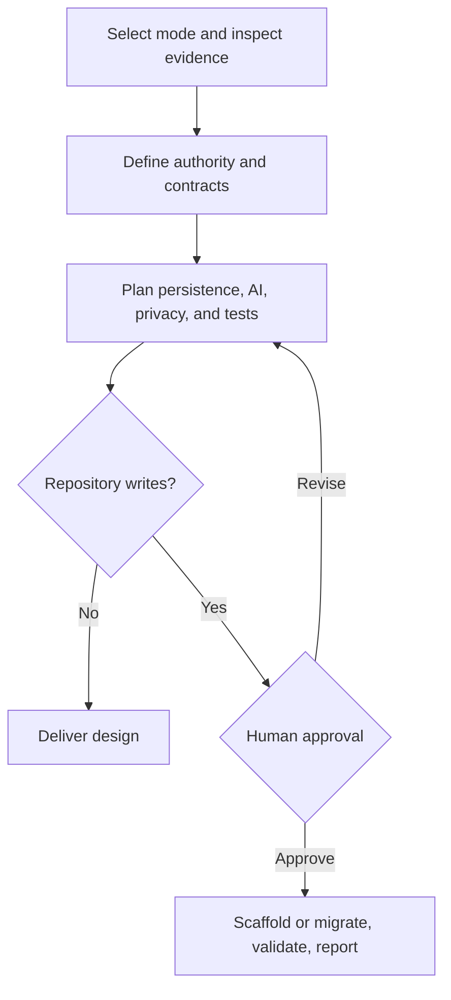

# Bootstrap Multiplayer Game Server

A reusable Agent Skill for turning a game concept or prototype into a production-minded, server-authoritative multiplayer foundation without prematurely building a full MMO.

It supports session-based strategy games, mysteries, cooperative adventures, simulations, and social-deduction games. It is deliberately genre-neutral and keeps generated content separate from authoritative gameplay.

> Models generate bounded, validated game content; deterministic server code owns gameplay truth and state transitions.

## When to use it

Use the skill when a game needs persistent multiplayer sessions, identity and membership, host permissions, clocks, private information, concurrent actions, AI-generated campaigns, recovery, solo play, or a path from a TypeScript prototype to ASP.NET Core.

Do not use it merely to add networking to an ordinary single-player game, answer a generic WebSocket question, create game content without a server foundation, or design a full MMO infrastructure program. The skill begins with the smallest architecture that satisfies the demonstrated requirements.

## Modes

| Mode | Starting point | Outcome |
| --- | --- | --- |
| **Design** | Game concept, PRD, or architecture question | Read-only architecture, contracts, persistence, risks, tests, and implementation phases |
| **Prototype** | Approved concept and optional repository | Sites-compatible React/TypeScript foundation with D1/R2/auth integration seams |
| **Migration** | Existing TypeScript prototype | ASP.NET Core mapping and implementation that preserves command, state, and projection behavior |

Design does not require GitHub. Prototype and Migration can work in an existing authorized repository and stop for explicit approval before modifying files.

## Workflow



### Design

The agent identifies the session shape, player limits, hidden information, host powers, clocks, solo behavior, persistence expectations, and generated-content needs. It then produces the system boundary, trust model, domain entities, commands, projections, persistence model, AI pipeline, test strategy, risks, scale triggers, and implementation phases.

### Prototype

After approval, the agent adapts the included contract assets to the game. React receives viewer-safe projections and submits commands. Sites server code authenticates and authorizes the player, evaluates the server clock, validates the expected revision, applies deterministic transitions, persists results, and returns a new projection. D1 stores relational state and history; R2 is reserved for justified large immutable artifacts.

Polling is the initial transport. SignalR or WebSockets can later notify clients of a new revision without changing command semantics or moving authority to a connection.

### Migration

The agent freezes portable JSON fixtures, maps TypeScript concepts to C#, implements equivalent state transitions and SQL guarantees, compares normalized outcomes, and separates transport upgrades from gameplay changes. Migration cannot silently change game behavior.

## Areas addressed

| Area | Foundation behavior |
| --- | --- |
| Authority | Server code owns membership, permissions, clocks, rules, transitions, and outcomes |
| State | Stable IDs, schema versions, monotonic revisions, snapshots, and explicit lifecycle |
| Commands | Authenticated actor, idempotency key, expected revision, atomic result, stable errors |
| Privacy | Allowlisted public, member, player-private, host, and administrative projections |
| Persistence | Sessions, memberships, snapshots, accepted events, receipts, checkpoints, and audit |
| Transport | Revision polling first; realtime remains an interchangeable authorized adapter |
| AI generation | Strict schemas, checkpoints, semantic validation, bounded repair, budgets, and fallbacks |
| Solo play | Explicit alternatives for quorum, votes, corroboration, role diversity, and trading |
| Migration | Language-neutral contract fixtures and observable TypeScript/C# parity |
| Validation | Authorization, leaks, races, timing, recovery, solvability, upgrades, and compatibility |

## Approval and execution boundaries

Read-only design does not authorize implementation. Prototype and Migration present exact proposed files and validation before requesting **approve**, **revise**, or **cancel**.

Repository approval does not authorize publishing, deployment, infrastructure provisioning, paid model calls, account or repository creation, destructive migrations, production data changes, or weakened security. Each requires separate authorization. Installing the skill grants no credentials or external permissions.

## Included resources

| Resource | Purpose |
| --- | --- |
| `SKILL.md` | Mode routing, workflow, invariant, approval gates, and completion criteria |
| `references/architecture.md` | Server boundary, modules, clocks, persistence, and scale triggers |
| `references/game-state-contract.md` | State, commands, revisions, idempotency, projections, and version evolution |
| `references/ai-generation-pipeline.md` | Structured generation, checkpoints, retries, budgets, fallback, and solvability |
| `references/security-and-concurrency.md` | Trust boundaries, authorization, races, leaks, recovery, and auditing |
| `references/sites-stack.md` | React/TypeScript, Sites server code, D1, R2, auth, polling, and realtime seam |
| `references/aspnet-portability.md` | ASP.NET Core, SignalR, SQL, Blob, OIDC, and behavioral migration |
| `references/validation-scenarios.md` | Eight realistic behavioral scenarios and focused checks |
| `assets/foundation-template/` | Adaptable TypeScript contracts, projector, commands, and D1-compatible schema |
| `scripts/validate_foundation.py` | Offline SQL and portability-fixture validation |

The template is not a complete game server, finished game, deployment, or MMO. It intentionally leaves game-specific payloads and deterministic transition functions to the target project.

## Validation

From the repository root, run:

```bash
python scripts/validate_repository.py
```

Validate the SQL template and language-neutral portability fixture without applying anything to a real database:

```bash
python engineering/bootstrap-multiplayer-game-server/scripts/validate_foundation.py
```

Type-check the TypeScript assets with the target repository’s supported TypeScript version before copying them into an implementation. Structural validation cannot prove authorization safety, concurrency behavior, game solvability, production capacity, or fun; run the selected behavioral scenarios and perform manual playtesting.

## Installation

Keep the complete directory together so its references and assets remain available.

### ChatGPT Work

Use the complete skill-directory URL for the current task:

```text
Use the bootstrap-multiplayer-game-server skill from this directory:
https://github.com/vladicaster/agent-skills/tree/main/engineering/bootstrap-multiplayer-game-server
```

Install it through a supported Skills or plugin workflow for reusable availability, then invoke it with `@bootstrap-multiplayer-game-server`.

### Codex

- Personal: `~/.agents/skills/bootstrap-multiplayer-game-server/`
- Project: `.agents/skills/bootstrap-multiplayer-game-server/`
- Invocation: `$bootstrap-multiplayer-game-server`

### Claude Code

- Personal: `~/.claude/skills/bootstrap-multiplayer-game-server/`
- Project: `.claude/skills/bootstrap-multiplayer-game-server/`
- Invocation: `/bootstrap-multiplayer-game-server`

GitHub authentication, filesystem access, hosting, model credentials, database access, and deployment permissions must be configured separately.

## Limitations

- The skill establishes a foundation; it does not build a complete game or generate an entire campaign library.
- Default stacks are recommendations, not requirements that override existing repository evidence.
- Polling may be insufficient for measured low-latency or high-fan-out needs.
- Generic solvability checks cannot prove every game design is enjoyable or logically complete.
- Portability fixtures reduce migration risk but do not replace load, security, recovery, and production cutover testing.
- Installed copies are snapshots and do not automatically receive source updates.

## Updating this skill

Installed copies do not automatically follow `main`.

- **ChatGPT Work:** Ask ChatGPT to update the installed skill from `https://github.com/vladicaster/agent-skills/tree/main/engineering/bootstrap-multiplayer-game-server`, review meaningful workflow or permission changes, and replace the complete directory.
- **Codex or Claude Code, symbolic link:** Pull the source checkout deliberately.
- **Codex or Claude Code, copied directory:** Pull the source, compare local customizations, and copy the complete skill again.
- **Pinned installation:** Use a Git tag when reproducibility matters and upgrade deliberately.

See the repository-wide versioning policy in [the root README](../../README.md#versioning-and-updates).
