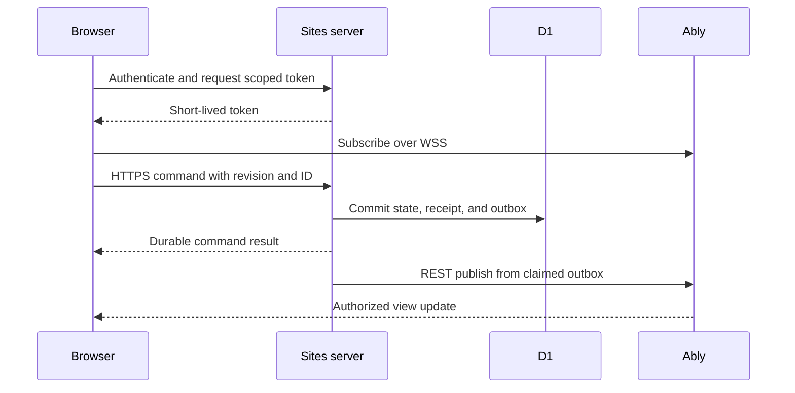

# Ably setup for Sites multiplayer

Use when the user selects Ably for interactive delivery. This is an end-to-end setup guide with TypeScript integration examples, not a deployed adapter. Authentication, database transactions, projection validation, and dispatcher hosting must be implemented against the target app. Do not manufacture Sites APIs or worker guarantees.

## Contents

- [Architecture and prerequisites](#architecture-and-prerequisites)
- [Configure the environment](#configure-the-environment)
- [Channels and credentials](#channels-and-credentials)
- [Server integration](#server-integration)
- [Publish recovery](#publish-recovery)
- [Browser integration](#browser-integration)
- [Removal and revocation](#removal-and-revocation)
- [Deployment and troubleshooting](#deployment-and-troubleshooting)

## Architecture and prerequisites



Browser connections terminate at Ably. Sites uses bounded HTTPS requests for commands, token issuance, snapshots, and publication. Sending an action or recovering a connection is not periodic polling. Ably's [REST and realtime interfaces](https://ably.com/docs/basics) support this separation.

Before choosing any native Sites socket path, verify sustained idle and active delivery, authentication renewal, reconnect, and cross-instance behavior in the actual deployment. A successful handshake is insufficient for every multiplayer game, not just continuous simulations. A rapid disconnect establishes a failed deployment test, not its root cause or a universal Sites restriction. Record close codes, durations, handler errors, and deployment configuration without tokens.

For Ably, verify browser WSS egress, server HTTPS egress, authenticated Sites handlers, server secret bindings, D1 atomicity, and an approved dispatcher. If a prerequisite is missing, name it and mark the integration blocked; do not silently fall back to polling. Ably supplies delivery, not gameplay authority or simulation ticks. Continuous games still follow [realtime-simulation.md](realtime-simulation.md).

## Configure the environment

1. With provisioning authorization, select/create separate Ably apps for development, staging, and production. Record the app, owner, region/retention requirements, service limits, and budget. Do not reuse production channels for preview tests.
2. Configure a server publishing key limited to `publish` on the app's game namespace. Use a separate signing key whose allowed capabilities bound the browser subscriptions. Enable revocable tokens on that signing key before issuing them if prompt removal is required.
3. Store `ABLY_PUBLISH_KEY` and `ABLY_TOKEN_KEY` in server-only secret bindings. Keep them out of frontend environment variables, source, URLs, logs, screenshots, and prompts. Supply configuration such as `GAME_ENV` separately. Read bindings through the actual host API; the examples accept injected strings.
4. Install exact dependency versions in the target project and commit its lockfile. The examples were checked with `ably@2.21.0`, `jose@6.1.0`, and TypeScript `5.9.3`; these are reproducibility pins, not a claim that they are the latest releases. Recheck supported versions and security notices when integrating. Test the browser bundle separately from server imports and verify Web Crypto/HTTPS support on the deployed runtime.
5. Configure permitted origins and the application's CSP for the documented Ably endpoints actually used, including fallback hosts. Origin checks supplement authentication; they are not identity. Do not broadly disable CSP. Verify that the pinned client uses WebSockets only when polling is forbidden.
6. Choose retention and message budgets. Start with no client history capability and HTTP recovery snapshots; do not enable rewind/history opportunistically. Set an application payload ceiling below current account limits, and cap rooms, subscriptions, publish rates, outbox backlog, and token requests. Estimate cost from player fan-out, messages, connections, and recovery traffic, not just player actions. Verify current [Ably limits](https://ably.com/docs/platform/pricing/limits) and pricing before provisioning.

## Channels and credentials

Use opaque server-generated IDs with a restricted alphabet; never concatenate arbitrary user labels or wildcard characters into capability names. The sample `segment` validator accepts only 1–64 ASCII letters, digits, underscores, and hyphens. Reject incompatible IDs or map them to stored opaque transport IDs. URI-encode complete channel names when using raw REST URLs.

| Channel | Allowed data | Browser capability |
| --- | --- | --- |
| `game:<env>:<session>:shared:<audienceEpoch>` | Only state intentionally visible to every currently authorized subscriber | `subscribe` only |
| `game:<env>:<session>:player:<membership>:<accessEpoch>` | That member's complete authorized view | `subscribe` only |
| Optional separate presence channel | Minimal public status, never role secrets or authority | Only the required `subscribe`/`presence` rights |

The baseline examples use the private per-member channel for complete views, including that member's shared state. This avoids assembling inconsistent shared/private updates. Add shared channels only for genuinely public-to-that-audience data and give each stream its own cursor. Never allow client publication to authoritative channels. Presence is optional and advisory; forged presence payloads cannot change membership or game rules.

Use an exact channel capability and a server-selected `clientId`. Do not accept requested capabilities, player IDs, or channel names from browser token parameters. Ably intersects token rights with the signing key's rights; a broad signing key is not permission to issue broad browser tokens. See [capabilities](https://ably.com/docs/auth/capabilities).

Issue tokens only after rechecking current membership, including renewal. The sample uses a ten-minute JWT, with `HS256`, key-name `kid`, and JSON-string capabilities as described by [Ably JWT authentication](https://ably.com/docs/auth/token/jwt). JWT contents are readable, so identifiers and claims must not contain secrets. Renewal uses the SDK auth endpoint, not a custom interval. Short lifetime alone does not provide immediate revocation; see [token authentication](https://ably.com/docs/auth/token).

## Server integration

Copy these blocks into separate modules in the target project. `declare` functions specify application seams and intentionally have no implementation here. Do not deploy until they are implemented and tested. Keep `server.ts` out of browser imports.

### Shared contract: `shared.ts`

```ts
export function segment(value: string): string {
  if (!/^[A-Za-z0-9_-]{1,64}$/.test(value)) throw new Error("invalid_transport_id");
  return value;
}

export interface Binding {
  sessionId: string;
  membershipId: string;
  accessEpoch: string;
  channel: string;
}

export interface ViewUpdate {
  eventId: string;
  sessionId: string;
  accessEpoch: string;
  viewVersion: 1;
  viewSequence: number;
  view: unknown; // Replace with the game's allowlisted projection schema.
}

export interface Command {
  commandId: string;
  commandType: string;
  commandVersion: number;
  expectedRevision: number;
  payload: unknown;
}
```

`viewSequence` increases within the member's access epoch and is allocated with the outbox record. It is not an Ably message serial or the canonical game revision. Use viewer-specific sequencing when revealing the existence of hidden actions or global revision changes would leak information. The authorized projection supplies command revision information only as permitted by the game's visibility contract.

### Authentication and command seam: `server.ts`

```ts
import { SignJWT } from "jose";
import * as Ably from "ably";
import { segment, type Binding, type ViewUpdate, type Command } from "./shared.js";

interface Member { id: string; sessionId: string; accessEpoch: string }
declare function requireMember(request: Request, sessionId: string): Promise<Member>;
declare function requireCsrfAndOrigin(request: Request): Promise<void>;
declare function readValidatedCommand(request: Request): Promise<Command>;
declare function commitCommandAndOutbox(member: Member, command: Command): Promise<unknown>;

export function binding(env: string, member: Member): Binding {
  const parts = [env, member.sessionId, member.id, member.accessEpoch].map(segment);
  return {
    sessionId: member.sessionId, membershipId: member.id, accessEpoch: member.accessEpoch,
    channel: `game:${parts[0]}:${parts[1]}:player:${parts[2]}:${parts[3]}`,
  };
}

export async function tokenRoute(request: Request, sessionId: string,
                                 env: string, signingKey: string): Promise<Response> {
  if (request.method !== "POST") return new Response(null, { status: 405 });
  await requireCsrfAndOrigin(request);
  const member = await requireMember(request, sessionId);
  const scope = binding(env, member);
  const split = signingKey.indexOf(":");
  if (split < 1 || split === signingKey.length - 1) throw new Error("invalid_server_key");
  const token = await new SignJWT({
    "x-ably-clientId": `member:${segment(member.id)}:${segment(member.accessEpoch)}`,
    "x-ably-capability": JSON.stringify({ [scope.channel]: ["subscribe"] }),
  }).setProtectedHeader({ alg: "HS256", typ: "JWT", kid: signingKey.slice(0, split) })
    .setIssuedAt().setExpirationTime("10m")
    .sign(new TextEncoder().encode(signingKey.slice(split + 1)));
  return new Response(token, {
    headers: { "Content-Type": "text/plain", "Cache-Control": "no-store" },
  });
}

export async function commandRoute(request: Request, sessionId: string): Promise<Response> {
  if (request.method !== "POST") return new Response(null, { status: 405 });
  await requireCsrfAndOrigin(request);
  const member = await requireMember(request, sessionId);
  const command = await readValidatedCommand(request);
  const result = await commitCommandAndOutbox(member, command);
  return Response.json(result, { headers: { "Cache-Control": "no-store" } });
}

export interface OutboxItem { channel: string; messageId: string; update: ViewUpdate }
export function publisher(serverKey: string) {
  const rest = new Ably.Rest({ key: serverKey });
  return async (item: OutboxItem): Promise<void> => {
    await rest.channels.get(item.channel).publish({
      id: item.messageId, name: "view.changed", data: item.update,
    });
  };
}
```

Wire `POST /api/sessions/:id/realtime/token` and `POST /api/sessions/:id/commands` to these functions. Add authenticated, non-cacheable GET routes for `/realtime/binding` (the current `Binding`) and `/snapshot` (a validated `ViewUpdate`). Derive all scope from the signed-in subject; a session URL selects a resource, never authority. Normalize authentication failures to 401, inactive membership to 403, malformed input to 400, and infrastructure failures to a safe 503; do not expose SDK errors or secret values to clients. Enforce request byte limits and rate limits before parsing.

`commitCommandAndOutbox` must recheck membership, command authorization, deadline, and expected revision at the transaction boundary. Match duplicate IDs to actor and payload; return the original safe receipt only to its authorized actor. Commit canonical state, events, receipt, each viewer's sequence/projection, and outbox entries atomically using verified target database capabilities. Return `stale_revision` without replaying the action if the revision loses. An accepted command is durable even if delivery is pending; never report it rejected solely because Ably is unavailable. Use the existing [game-state contract](game-state-contract.md).

Snapshot reads must return a complete current authorized view paired consistently with its durable stream sequence and access epoch. Do not return a lagging replica without a read-consistency/retry contract. The publisher receives only trusted claimed outbox rows; it is not a public endpoint that accepts arbitrary channels or payloads.

## Publish recovery

Store outbox fields alongside the game schema in the target implementation: event ID, immutable channel/audience epoch, message ID, safe payload/schema version, view sequence, status, attempts, next attempt time, lease owner/expiry, and sanitized last failure. Uniqueness covers both event identity and stream sequence. Do not alter the bundled foundation SQL merely by installing this guide.

The dispatcher follows this contract:

1. Atomically claim a bounded batch of due rows with an expiring lease; use conditional completion so an expired worker cannot overwrite another claim. Serialize within a stream where ordering matters.
2. Recheck the target membership/access epoch before publishing; suppress revoked targets. Never redirect old private payloads to a new audience. Coordinate membership changes and publication as described below.
3. Await REST publication. Only then mark that row delivered. A timeout or crash after publication may produce a duplicate on retry; keep the same stored message ID and payload.
4. Retry transient failures with jittered exponential backoff, bounded attempts/time, and account-aware rate handling. Quarantine invalid payloads or forbidden-key errors for correction instead of looping. Redrive intentionally after fixing the cause, preserving IDs.
5. Expose delivery lag, oldest pending event, attempts, quarantine count, and last successful dispatch. Alert on backlog. Do not log token bodies, full private views, or key-bearing URLs.

Ably's deduplication window is finite; application event/sequence deduplication remains necessary after it expires. Publisher SDK retries and fresh worker attempts must share a stable stored ID. Do not promise exactly-once delivery or atomic publication across multiple channels. See [idempotent publication](https://ably.com/docs/pub-sub/advanced#idempotent-publishing).

Name the mechanism that runs step 1 even when no player makes another request: an approved durable queue/scheduled executor with verified Sites access, or an external dispatcher using an authenticated service boundary. A request may perform a bounded immediate flush for latency, but that is not recovery scheduling. Unawaited promises, an assumed `waitUntil`, an in-memory timer, and “retry on the next command” cannot establish eventual delivery after a crash. Server-side outbox scanning by an approved scheduler is not browser polling; record its cadence and database cost.

If no dispatcher can run, mark reliable publication **blocked**. An explicitly approved degraded prototype can show “saved; live delivery pending” and allow a manual snapshot refresh, but must not claim eventual push or silently start polling. If the game cannot tolerate stale players, pause progression rather than conceal the outage. Before resuming live status, reconcile pending rows or issue a durable fresh-view event for each authorized member.

## Browser integration

The following `browser.ts` demonstrates the SDK boundary. `decodeView` is an app-supplied runtime schema validator; it checks all envelope fields and every allowed projection field. `render` must not interpret arbitrary HTML. `status` and `reportSafeFailure` show safe user-facing states without raw credentials/errors.

```ts
import * as Ably from "ably";
import type { Binding, Command, ViewUpdate } from "./shared.js";
declare function decodeView(value: unknown): ViewUpdate;
declare function render(update: ViewUpdate): void;
declare function status(value: string): void;
declare function reportSafeFailure(): void;

export function openRoom(scope: Binding, csrfToken: string): () => void {
  const base = `/api/sessions/${encodeURIComponent(scope.sessionId)}`;
  const abort = new AbortController();
  let stopped = false, sequence = -1, outageTimer: ReturnType<typeof setTimeout> | undefined;
  let snapshotInFlight = false, snapshotAgain = false;
  const recoveryTimes: number[] = [];
  const realtime = new Ably.Realtime({
    autoConnect: false, transports: ["web_socket"], queueMessages: false,
    authUrl: `${base}/realtime/token`, authMethod: "POST",
    authHeaders: { "X-CSRF-Token": csrfToken },
  });
  const channel = realtime.channels.get(scope.channel);
  const accept = (raw: unknown) => {
    if (stopped) return;
    const value = decodeView(raw);
    if (value.sessionId !== scope.sessionId || value.accessEpoch !== scope.accessEpoch) {
      throw new Error("binding_changed");
    }
    if (value.viewSequence <= sequence) return;
    sequence = value.viewSequence;
    render(value); // Complete view replacement, not a delta merge.
  };
  const snapshot = async () => {
    if (snapshotInFlight) { snapshotAgain = true; return; }
    snapshotInFlight = true;
    try {
      do {
        snapshotAgain = false;
        const now = Date.now();
        while (recoveryTimes.length && recoveryTimes[0] < now - 60_000) recoveryTimes.shift();
        if (recoveryTimes.length >= 6) throw new Error("recovery_budget_exceeded");
        recoveryTimes.push(now);
        const timeout = setTimeout(() => abort.abort(), 10_000);
        try {
        const response = await fetch(`${base}/snapshot`, {
          credentials: "same-origin", cache: "no-store", signal: abort.signal,
        });
        if (!response.ok) throw new Error("snapshot_unavailable");
        accept(await response.json());
        } finally { clearTimeout(timeout); }
      } while (snapshotAgain && !stopped);
      if (!stopped && channel.state === "attached") status("Live");
    } catch {
      if (!stopped) { status("Refresh required"); reportSafeFailure(); stop(); }
    } finally { snapshotInFlight = false; }
  };
  const listener = (message: Ably.Message) => {
    try { accept(message.data); }
    catch { status("Refresh required"); reportSafeFailure(); stop(); }
  };
  const attached = () => { if (!stopped) void snapshot(); };
  const continuityChanged = (change: Ably.ChannelStateChange) => {
    if (!change.resumed && !stopped) void snapshot();
  };
  const stateChanged = (change: Ably.ConnectionStateChange) => {
    if (stopped) return;
    if (change.current === "connected") {
      clearTimeout(outageTimer); outageTimer = undefined;
      status("Synchronizing");
      if (channel.state === "attached") void snapshot();
    } else if (["failed", "closed"].includes(change.current)) {
      status("Reconnect required"); stop();
    } else {
      status("Reconnecting");
      outageTimer ??= setTimeout(() => { status("Reconnect required"); stop(); }, 120_000);
    }
  };
  const channelChanged = () => { status("Refresh required"); stop(); };
  function stop() {
    if (stopped) return;
    stopped = true; abort.abort(); clearTimeout(outageTimer);
    channel.unsubscribe("view.changed", listener);
    channel.off("attached", attached); channel.off("failed", channelChanged);
    channel.off("suspended", channelChanged);
    channel.off("update", continuityChanged);
    realtime.connection.off(stateChanged); realtime.close();
  }
  realtime.connection.on(stateChanged);
  channel.on("attached", attached); channel.on("failed", channelChanged);
  channel.on("suspended", channelChanged);
  channel.on("update", continuityChanged);
  // Register before connect so initial messages cannot outrun the listener.
  void channel.subscribe("view.changed", listener).catch(() => {
    if (!stopped) { status("Reconnect required"); stop(); }
  });
  realtime.connect();
  return stop;
}

export async function sendCommand(sessionId: string, command: Command, csrfToken: string) {
  const response = await fetch(`/api/sessions/${encodeURIComponent(sessionId)}/commands`, {
    method: "POST", credentials: "same-origin",
    headers: { "Content-Type": "application/json", "X-CSRF-Token": csrfToken },
    body: JSON.stringify(command),
  });
  if (!response.ok) throw new Error("command_transport_failed");
  return response.json(); // Validate the app's accepted/rejected result schema before use.
}
```

Load and validate the binding via the authenticated GET endpoint before `openRoom`; create one room connection per mounted room and invoke its returned cleanup on logout, navigation, or room replacement. In React, place that lifecycle in an effect with stable dependencies, not on every render. The UI's explicit Reconnect action fetches a new binding before creating a new client. Authentication middleware must accept the SDK's same-origin POST credentials and CSRF header; validate this in deployment.

Keep the same command ID and payload after an ambiguous timeout; do not automatically generate a new action. A rejected/stale command is shown as such. A pending HTTP result must not disable the socket or make a browser publish canonical state. Add app-level abort/time budgets for action requests and validate returned receipts before rendering.

The example subscribes before reading a snapshot. Both carry complete views and monotonic per-view sequence numbers, so a delayed HTTP snapshot cannot overwrite a newer live update. Gaps in full-view sequences may be accepted because the view replaces state; do not derive one-off rewards or animations from missing intermediate events. Deltas instead require an exact baseline and bounded buffering/resnapshot on gaps. Do not compare independent shared/private cursors or skip private messages because the shared stream already reached a revision.

Request a snapshot after initial attach and reconnection, and on an SDK channel `update` indicating lost continuity (`resumed === false`). The example coalesces requests, limits recovery to six snapshots per minute, and stops for explicit recovery after a ten-second snapshot timeout. Tune these application budgets under load without adding recurring state requests.

Do not use Ably history as proof of current authorization. A snapshot is the fallback when history is expired, unavailable, or unsafe for a newly joined viewer. Distinguish transport-connected from synchronized game state. Do not label a saved command delivered merely because the client is connected. See [connection recovery](https://ably.com/docs/connect/states).

The WebSocket-only option is intentional: the SDK may otherwise use HTTP fallback transports. Verify against the pinned [JavaScript SDK types/source](https://github.com/ably/ably-js/blob/v2.21.0/ably.d.ts) and deployed network traffic. SDK heartbeats, token renewal, connection backoff, initial snapshots, and event-triggered recovery are allowed; no recurring state-fetch loop or XHR polling fallback is added. The example's two-minute outage limit is an application choice, not an availability guarantee.

## Removal and revocation

Membership removal immediately blocks Sites commands, snapshots, and new tokens. Existing tokens remain usable until expiry unless revoked; a cooperative client detach is not enforcement. Ably revocation must have been enabled on the issuing key, and the revocation request uses that same key. Use a narrow target such as the server-assigned membership/epoch client ID with no reauthorization grace when prompt enforcement is required. Ably describes enforcement as near-immediate, not zero latency. See [token revocation](https://ably.com/docs/auth/revocation).

For strict privacy, stop future publication to the removed audience before confirming removal complete. Increment stored access epochs; shared audiences require channel rotation and credential refresh for remaining members. Serialize this boundary with outbox dispatch, cancel obsolete pending payloads, and wait for in-flight publication to resolve before resuming protected delivery. A JWT signed concurrently with removal must be unable to read new-epoch channels. Never issue wildcard capabilities spanning epochs. Retry failed revocation durably; show a pending enforcement state and keep affected delivery paused rather than claiming instant removal. An approved expiry-only policy must disclose the residual access window.

Rejoining receives a new access epoch and a current authorized snapshot, not the old channel/history. Data already delivered cannot be recalled. Retention, rewind, presence history, and third-party storage must match the game's privacy policy. Give ordinary hosts no extra access to private views. Security tests must use a noncooperative client retaining its old token.

## Deployment and troubleshooting

Before approved rollout, record the exact source, dependency versions, key capabilities, runtime configuration, dispatcher mechanism, payload budget, and evidence below. Test a staging app first; keep any existing working transport behind an explicit configuration choice rather than an automatic fallback. Rollback disables the new transport and pauses live play or restores a separately approved known-good provider; it must not silently enable polling.

| Check | Evidence required |
| --- | --- |
| Two distinct players | Sustained idle and active WSS delivery past token renewal; both converge on the same permitted state |
| Authorization | No token for unauthenticated/nonmember callers; exact channels only; forged identity, wildcard scope, and browser publication fail |
| Privacy/removal | Other-player secrets absent from traffic/logs/history; retained old tokens cannot receive new-epoch private events |
| Transaction/publication | Crash before commit changes nothing; crash after commit leaves recoverable outbox; ambiguous publish acknowledgment causes no duplicate game effect |
| Recovery | Disconnect, SDK continuity loss, epoch change, concurrent snapshot/update, and exhausted history recover safely or show explicit blocked status |
| Dispatcher | Expired leases, multiple workers, permanent errors, retry exhaustion, and manual redrive preserve IDs and expose backlog |
| No polling | Browser network capture shows WSS delivery and justified HTTPS requests, no periodic state requests or polling transports |
| Limits/cost | Payload/fan-out limits, slow clients, sustained load, token refresh volume, and delivery lag stay within declared budgets |

If the connection loops: inspect the actual WSS destination, sanitized connection/channel reasons, auth response status/content type, signing clock, key app/capabilities, CSP, and repeated component mounts. If connected but stale: inspect channel attachment, outbox age/dispatcher health, view sequence/epoch, and schema validation. For 401/403, repair authentication or configuration; do not broaden capabilities to `*` to make it pass. For oversized payloads, reduce projections or send a safe invalidation followed by a bounded event-triggered snapshot, not an HTTP polling loop.

Run repository and foundation validators, type-check the examples against pinned dependencies, and test application seams independently. Report live account/runtime checks as **not run** until they actually execute. This guide grants no credentials or deployment permission. Installed skill copies update only through a separately requested refresh.
