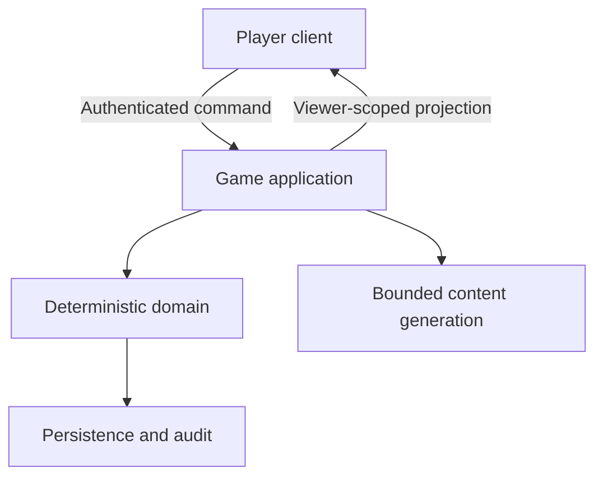

# Architecture

## Foundation boundary

Use a modular server-authoritative application before considering MMO infrastructure.

The client may render, predict cosmetically, and request actions. Only the application/domain boundary may authorize membership, evaluate preconditions, read the authoritative clock, apply a transition, increment a revision, or create a shared/private projection.

## Minimum modules

| Module | Owns |
| --- | --- |
| Identity and membership | Authenticated subject, session membership, roles, host transfer, bans/leaves |
| Session | Lifecycle, configuration, schema version, active campaign, revision |
| Domain | Commands, deterministic rules, clocks, transitions, outcomes |
| Projection | Public, member, player-private, host, and administrative views |
| Persistence | Sessions, snapshots, accepted events, idempotency receipts, audit |
| Generation | Jobs, checkpoints, schemas, validation, budgets, fallbacks |
| Transport | Authenticated WebSocket sessions plus initial/recovery resynchronization |

Keep these as modules in one deployable application unless evidence requires separation.

## Time and presence

- Use a server clock abstraction. Store instants in UTC and durations explicitly.
- Treat deadlines as data, not timers held only in process memory.
- Re-evaluate overdue transitions on commands, connection activity, scheduled work, and recovery.
- Presence is advisory. Authorization and game progress must not depend on a fragile “online” flag.
- Record last-seen time and connection leases separately from membership.

## Realtime delivery

For interactive Sites games, use WebSockets without periodic polling. On connection, authenticate the subject, resolve membership server-side, and bind the connection only as a delivery channel. Require the client to provide its last known revision during reconnect; reply with missed authorized updates when safely available or a fresh viewer-scoped projection otherwise.

Verify sustained deployed delivery for every multiplayer game before choosing a native socket endpoint. With the selected [Ably profile](ably-setup.md), commands use Sites HTTPS handlers and browsers subscribe directly to Ably; Sites publishes safe events via REST. An atomic outbox plus a verified dispatcher bridges durable commits and delivery failures. Distinguish canonical revision from per-view stream cursors where private activity cannot be exposed.

Maintain a snapshot/resynchronization operation for initial load and recovery. It may use HTTP or the WebSocket protocol, but must not become a periodic polling loop. Treat disconnects, duplicate delivery, out-of-order messages, backpressure, and server-instance changes as normal operating conditions.

For continuous graphical simulation, separate rendering, transport, authoritative ticks, and durable checkpoint cadence. Use [realtime-simulation.md](realtime-simulation.md) for the conditional Sites-native or external-simulator profile, runtime evidence, sequenced inputs, ownership/fencing, and recovery loss bounds. Prefer the modular baseline where supported, but do not defer a required execution boundary merely because the game has few players.

## Persistence choices

Snapshots plus an append-only accepted-event/audit trail are a pragmatic default. Events need not be the sole source of truth. State which records are authoritative, which support recovery, and which exist only for explanation or analytics.

Use object storage for large immutable generated artifacts, media, or raw model responses when retention is justified. Store hashes and references with the generation checkpoint. Do not put secrets or private player material in public object paths.

## Scale triggers

Reconsider the modular baseline only when measurement shows a need such as high fan-out, hot-session contention, regional latency targets, sustained generation backlog, storage limits, or independent release/ownership boundaries. Document the measured trigger before adding queues, caches, partitions, or services.
