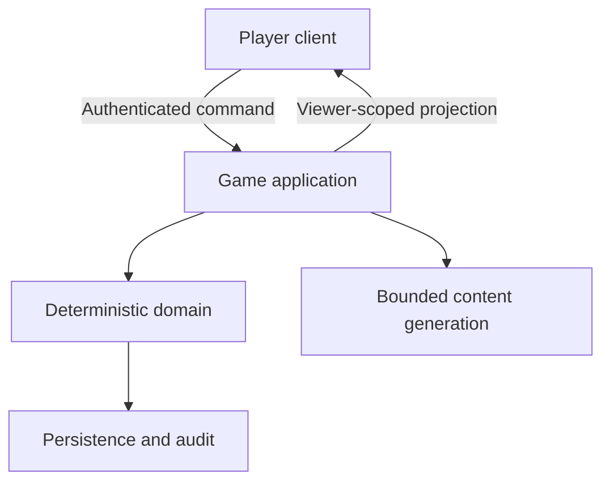

# Architecture

## Foundation boundary

Use a modular server-authoritative application before considering MMO infrastructure.

The client may render, predict cosmetically, and request actions. Only the application/domain boundary may authorize membership, evaluate preconditions, read the authoritative clock, apply a transition, increment a revision, or create a shared/private projection.

## Minimum modules

| Module | Owns |
| --- | --- |
| Identity and membership | Authenticated subject, session membership, roles, host transfer, bans/leaves |
| Session | Lifecycle, configuration, schema version, active campaign, revision |
| Domain | Commands, deterministic rules, clocks, transitions, outcomes |
| Projection | Public, member, player-private, host, and administrative views |
| Persistence | Sessions, snapshots, accepted events, idempotency receipts, audit |
| Generation | Jobs, checkpoints, schemas, validation, budgets, fallbacks |
| Transport | Polling endpoints initially; realtime notifications later |

Keep these as modules in one deployable application unless evidence requires separation.

## Time and presence

- Use a server clock abstraction. Store instants in UTC and durations explicitly.
- Treat deadlines as data, not timers held only in process memory.
- Re-evaluate overdue transitions on commands, polling, scheduled work, and recovery.
- Presence is advisory. Authorization and game progress must not depend on a fragile “online” flag.
- Record last-seen time and connection leases separately from membership.

## Persistence choices

Snapshots plus an append-only accepted-event/audit trail are a pragmatic default. Events need not be the sole source of truth. State which records are authoritative, which support recovery, and which exist only for explanation or analytics.

Use object storage for large immutable generated artifacts, media, or raw model responses when retention is justified. Store hashes and references with the generation checkpoint. Do not put secrets or private player material in public object paths.

## Scale triggers

Reconsider the modular baseline only when measurement shows a need such as high fan-out, hot-session contention, regional latency targets, sustained generation backlog, storage limits, or independent release/ownership boundaries. Document the measured trigger before adding queues, caches, partitions, or services.
