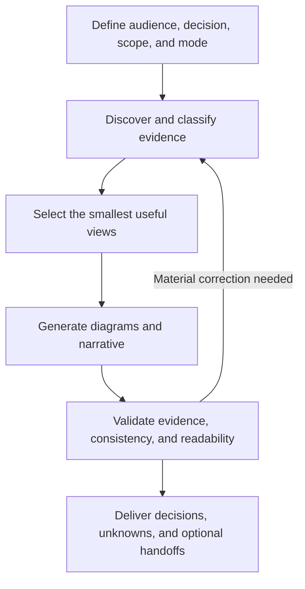

# Develop C4 Architecture

Develop C4 architecture models that make system boundaries, responsibilities, dependencies, evidence, proposals, and unknowns visible. The skill supports early brainstorming as well as evidence-backed discovery from repositories and existing diagrams.

## Purpose

Use this skill to:

- brainstorm a proposed architecture from a product idea or requirements;
- derive a current-state architecture from one or more repositories;
- audit and refine existing C4 diagrams;
- assess how a proposed change affects systems, containers, data, integrations, trust boundaries, and operations;
- generate System Context, Container, and justified Component views;
- produce Mermaid, C4-PlantUML, or Structurizr DSL artifacts;
- separate observed facts from inference, proposals, and unknowns.

The output is an architecture model for communication and decisions. It is not proof of runtime behavior, production topology, security, scalability, or implementation correctness.

## When to use it

Recognizable requests include:

- "Brainstorm the architecture for this platform."
- "Create C4 diagrams from these repositories."
- "Turn this PRD into a proposed C4 architecture."
- "Correct and expand this container diagram."
- "Show the current and target architecture for this change."
- "Review this C4 model for missing boundaries or unsupported assumptions."

Do not use it as the primary workflow for writing a PRD, adopting ADRs, configuring a coding-agent harness, implementing application changes, or managing a GitHub issue-to-PR lifecycle. It may supply evidence and approved architecture artifacts to those workflows.

## Starting modes

| Mode | Starting point | Primary result |
| --- | --- | --- |
| Brainstorm | Idea, conversation, requirements, or approved PRD | Proposed architecture and decision questions |
| Repository discovery | Repositories plus available documentation | Evidence-backed current-state model |
| Existing-system refinement | Existing diagrams and current evidence | Findings and corrected or expanded views |
| Change impact | Current evidence plus proposed change | Current/target comparison and downstream implications |

The skill reuses compatible approved inputs and invokes no other skill merely because one could be useful.

## Evidence discipline

Every material architecture statement is classified as:

| Classification | Meaning |
| --- | --- |
| Observed | Explicitly supported by inspected evidence |
| Inferred | Suggested by evidence but not explicitly confirmed |
| Proposed | A target-state recommendation requiring a decision |
| Unknown | Unresolved information that may affect the model |

This prevents repository names, stale documentation, local configuration, or plausible conventions from being presented as verified production architecture.

## C4 and supplemental views

The workflow chooses the smallest useful view set:

- **System Context** for people, scope, and external systems.
- **Container** for runnable or deployable responsibilities, data stores, and major interactions.
- **Component** for the internal structure of one selected container only when evidence and audience justify it.
- **Code** only when explicitly requested and adequately supported by stable source evidence.

Deployment, dynamic/request-flow, data-flow, trust-boundary, and current-versus-target views may supplement C4 when they materially improve the explanation.

## Notation

Mermaid is the portable default for Markdown and conversation. Use C4-PlantUML when requested or established in the destination. Use Structurizr DSL when a reusable model with multiple consistent views is desired or already established.

The skill validates syntax when compatible tooling is available, but it reports semantic and visual review separately.

## Workflow



The resulting package may contain:

1. Purpose and scope.
2. A minimal diagram set.
3. Architecture narrative.
4. Evidence and inference record.
5. Proposed decisions and alternatives.
6. Material unknowns.
7. Validation results reported as Passed, Failed, Blocked, Manual, or Not run.

## Approval and execution boundaries

Read-only inspection, brainstorming, and diagram generation do not authorize:

- writing to a repository or document destination;
- publishing or externally sharing an artifact;
- adopting or publishing an ADR;
- creating implementation issues;
- changing a coding-agent harness;
- modifying code, infrastructure, data, or production systems;
- deploying or purchasing services.

Obtain the authorization appropriate to each consequential action. GitHub is unnecessary for conversational or portable artifacts. For authorized repository writes, follow the repository instructions and the shared [GitHub and repository readiness guide](../../docs/github-repository-readiness.md).

## Repository write-back

When explicitly requested and authorized, the skill can write C4 source files, architecture narratives, evidence records, and necessary catalog or documentation links back to GitHub or another repository destination.

Supported delivery modes are:

| Mode | Behavior |
| --- | --- |
| Artifact update only | Update files on an already approved non-default branch |
| Feature-branch delivery | Create a branch, write and validate artifacts, commit, and push |
| Draft-PR delivery | Perform feature-branch delivery and open a draft pull request |
| Gated issue-to-PR delivery | Use `github-issue-to-draft-pr` for issue creation, approval, implementation, and a linked draft PR |

Before writing, the workflow confirms the repository, actual default branch, identity and permissions, destination paths, notation, and whether files are new or existing. It never commits directly to the default or protected branch. It validates the destination repository and diagram notation when compatible tooling exists, reviews the diff for sensitive evidence and unrelated changes, and reports the branch, files, commit, draft PR when created, checks, and remaining manual review.

An instruction to brainstorm or generate a diagram does not authorize repository write-back. An explicit instruction to save, commit, push, or open a draft PR authorizes only the named actions and their necessary non-destructive prerequisites.

## Included resources

- [`references/architecture-discovery.md`](references/architecture-discovery.md) defines evidence collection for each starting mode.
- [`references/c4-model-guidance.md`](references/c4-model-guidance.md) defines view selection, modeling rules, and notation choices.
- [`references/diagram-quality-checklist.md`](references/diagram-quality-checklist.md) provides semantic, evidence, readability, and artifact checks.
- [`assets/c4-templates.md`](assets/c4-templates.md) provides adaptable Mermaid, C4-PlantUML, Structurizr, and narrative templates.

## Validation

From the repository root, run:

```bash
python scripts/validate_repository.py
```

The repository validator checks required skill structure, frontmatter, catalog links, Python syntax, and visible escaped-newline errors. It does not prove architectural truth, evidence completeness, diagram readability, or notation compatibility with every renderer. Those checks remain part of the skill's explicit quality review.

## Installation

Install the complete `engineering/develop-c4-architecture` directory so its entry point and supporting resources remain together.

| Host | Typical destination or method |
| --- | --- |
| ChatGPT Work | Install the skill through a supported Skills workflow or plugin package |
| Codex, personal | `~/.agents/skills/develop-c4-architecture/` |
| Codex, project | `.agents/skills/develop-c4-architecture/` |
| Claude Code, personal | `~/.claude/skills/develop-c4-architecture/` |
| Claude Code, project | `.claude/skills/develop-c4-architecture/` |

Installing the skill does not grant repository, renderer, document, or deployment permissions.

## Invocation

Invoke explicitly with a request such as:

```text
Use @develop-c4-architecture to derive System Context and Container diagrams from this repository. Classify every material relationship as Observed, Inferred, Proposed, or Unknown.
```

The skill may also trigger automatically when its description closely matches the request and the host supports implicit invocation.

## Updating this skill

Installed copies are snapshots unless deliberately linked to a checkout. Update explicitly from the same source so workflow and approval changes can be reviewed. Use a tagged source when reproducibility matters. For ChatGPT Work, request an update from:

```text
https://github.com/vladicaster/agent-skills/tree/main/engineering/develop-c4-architecture
```

For copied Codex or Claude Code installations, replace the complete directory. Symbolic-link installations follow their source checkout.

## Limitations

- Repository discovery is limited by the repositories, revisions, configuration, deployment evidence, and documentation actually available.
- Runtime topology may differ from source and local configuration.
- Component and Code views become stale more quickly than Context and Container views.
- Mermaid support varies among hosts; C4-PlantUML and Structurizr require compatible tooling.
- Syntax validation does not establish architecture correctness.
- Sensitive or proprietary evidence must not be copied into public or reusable outputs.
