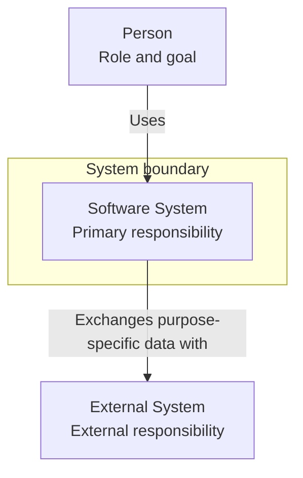
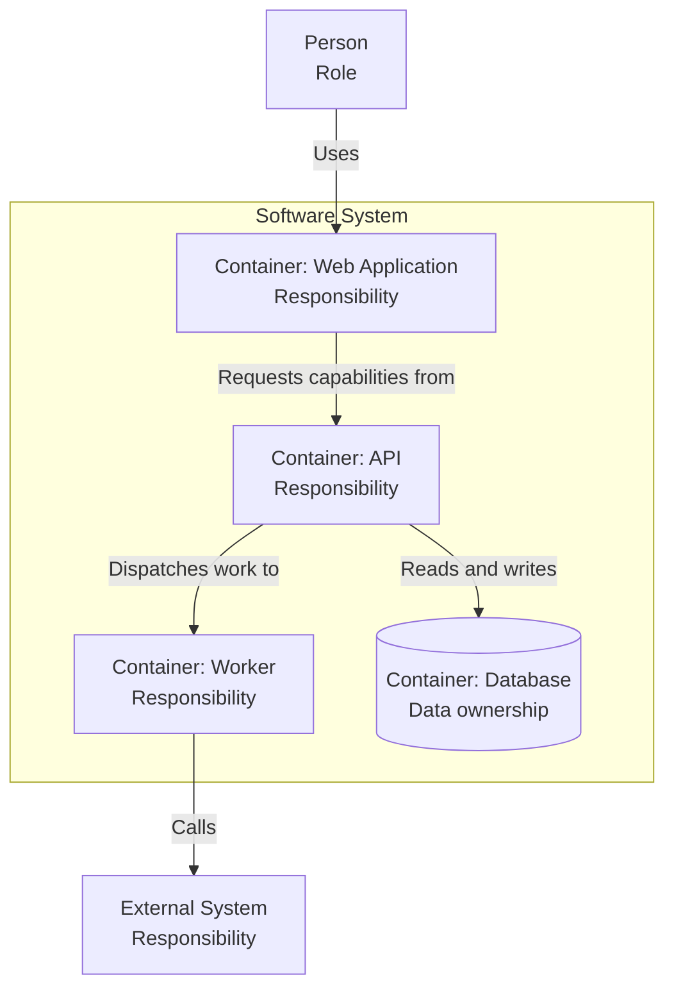
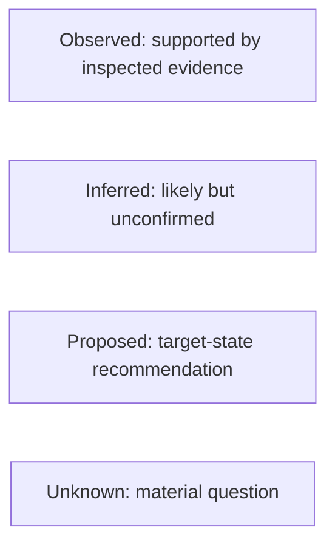
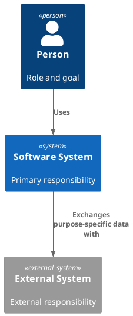

# C4 templates

Adapt these templates to the evidence and destination. Remove placeholder elements and unused legends.

## Mermaid System Context



## Mermaid Container



## Mermaid evidence-status legend

Use text labels when styling is unsupported or color would be the only distinction:



## C4-PlantUML System Context



Confirm the destination permits and resolves the selected include strategy.

## Structurizr DSL workspace

```text
workspace "System architecture" "Decision and scope" {
    model {
        user = person "Person" "Role and goal"
        system = softwareSystem "Software System" "Primary responsibility" {
            web = container "Web Application" "User experience" "Technology if relevant"
            api = container "API" "Application capabilities" "Technology if relevant"
            database = container "Database" "Owned data" "Database technology"
        }
        external = softwareSystem "External System" "External responsibility" "External"

        user -> web "Uses"
        web -> api "Requests capabilities from"
        api -> database "Reads and writes"
        api -> external "Exchanges purpose-specific data with"
    }

    views {
        systemContext system "Context" {
            include *
            autoLayout
        }
        container system "Containers" {
            include *
            autoLayout
        }
    }
}
```

## Architecture narrative

```markdown
## Purpose and scope

- Audience:
- Decision:
- Mode:
- System boundary:
- State: Current / Target / Both

## Responsibilities and interactions

Summarize the principal elements, data ownership, and important interaction paths.

## Evidence and assumptions

| Claim or element | Classification | Evidence or basis | Confidence |
| --- | --- | --- | --- |

## Proposed decisions

| Proposal | Alternatives | Rationale | Approval needed from |
| --- | --- | --- | --- |

## Unknowns

| Question | Architectural impact | Next evidence or owner |
| --- | --- | --- |

## Validation

| Check | Status | Evidence or limitation |
| --- | --- | --- |
```
