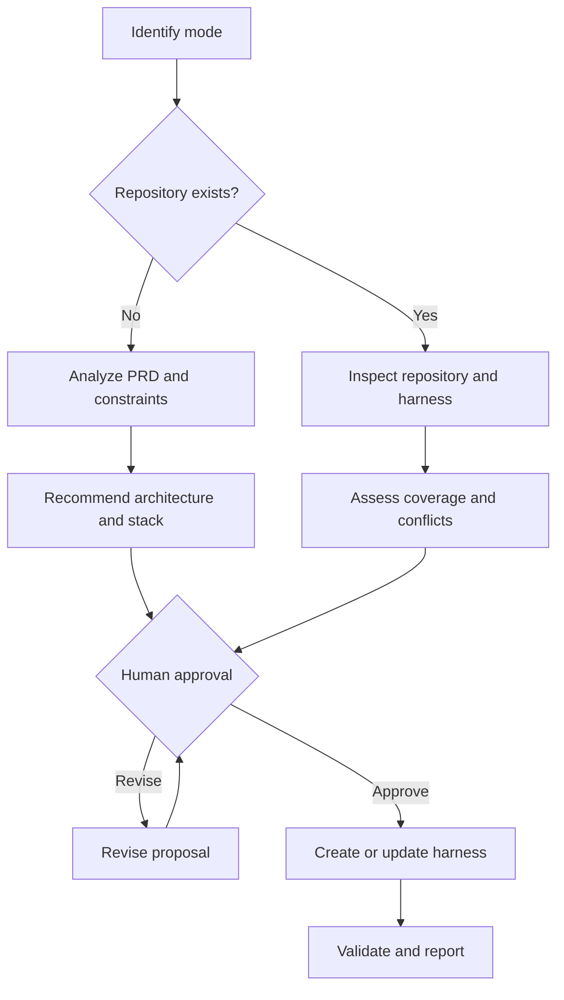

# Manage Coding-Agent Harness

A technology-neutral Agent Skill for creating and managing the instruction system that guides coding agents through architecture, implementation, validation, and delivery.

It works with either:

- An existing repository that needs a new or improved harness.
- A greenfield project described by a PRD, specification, or project brief before a repository exists.

The skill treats a harness as more than an `AGENTS.md` file. A complete harness can include repository instructions, architecture decisions, engineering standards, contribution templates, host-specific adapters, and deterministic enforcement through tests, linters, CI, and repository permissions.

## What the skill can do

| Mode | Starting point | Outcome |
| --- | --- | --- |
| **Bootstrap** | PRD or project brief; no repository | Recommends an architecture and stack, obtains approval, and creates a provisional harness package |
| **Create** | Existing repository without an adequate harness | Creates a repository-grounded harness |
| **Audit** | Existing repository and harness | Reports coverage, gaps, duplication, stale guidance, and contradictions without changing files |
| **Update** | New engineering or workflow requirement | Applies an approved, targeted harness change |
| **Repair** | Broken or conflicting harness | Reconciles instructions and establishes canonical policy locations |
| **Validate** | Existing or proposed harness | Assesses completeness and internal consistency without changing files |
| **Explain** | Existing harness | Describes the effective policy and how agents should behave |
| **Reconcile** | Provisional greenfield harness plus a new repository | Aligns provisional decisions and instructions with the actual implementation |

Audit, Validate, and Explain are read-only. Bootstrap, Create, Update, Repair, and Reconcile stop for explicit approval before changing or generating harness files.

## How it works



### Step 1: Determine the operating mode

The skill establishes whether the request is to bootstrap, create, audit, update, repair, validate, explain, or reconcile a harness. If the user asks a question rather than requesting a change, it defaults to a read-only mode.

### Step 2: Inspect the available evidence

For an existing repository, it inventories and examines:

- Root and nested `AGENTS.md` files.
- `CLAUDE.md`, Copilot instructions, and other host-specific files.
- Architecture and engineering documentation.
- Issue and pull-request templates.
- Source layout, project manifests, dependency boundaries, and configuration.
- Build, test, lint, formatting, static-analysis, and CI definitions.
- Existing security, observability, deployment, and operational guidance.
- Instruction scope, precedence, duplication, contradictions, and stale paths.

For a greenfield project, it extracts from the PRD:

- Functional requirements and product shape.
- Users, interfaces, integrations, data, and realtime needs.
- Expected scale and performance.
- Security, privacy, compliance, availability, and recovery requirements.
- Team experience, staffing, budget, schedule, and hosting constraints.
- AI, RAG, agent, search, analytics, or media-processing requirements.
- Known decisions, provisional assumptions, and unanswered questions.

### Step 3: Recommend the engineering baseline

When architecture or stack decisions are needed, the skill:

1. Identifies hard constraints and required quality attributes.
2. Recommends the simplest viable system shape.
3. Selects technologies based on requirements, team fit, maturity, operations, cost, security, and portability.
4. Presents one preferred stack and at most one meaningful alternative.
5. Explains tradeoffs, operational burden, vendor lock-in, and triggers for reconsideration.

It does not add microservices, Kubernetes, messaging, caching, search infrastructure, vector storage, or multiple databases merely as future-proofing.

### Step 4: Assess the harness

Each applicable capability is classified as:

- **Covered**
- **Partial**
- **Missing**
- **Conflicting**
- **Not applicable**

The assessment cites repository or PRD evidence instead of relying on generic assumptions.

### Step 5: Present the proposal

Before making changes, the skill presents:

1. Current or proposed harness inventory.
2. Requirements and constraints.
3. Assumptions and open questions.
4. Coverage gaps, conflicts, duplication, and stale guidance.
5. Proposed architecture and stack when relevant.
6. Exact files to create, update, retain, or supersede.
7. Implementation and validation plan.

The user can **approve**, **revise**, or **cancel**.

### Step 6: Create or update the harness

After approval, the skill:

1. Reconfirms the approved decisions and file scope.
2. Preserves useful existing guidance and project terminology.
3. Creates only the files and policies that apply.
4. Keeps root instructions concise and links to detailed canonical references.
5. Uses host-specific files as thin adapters instead of duplicating shared policy.
6. Verifies commands, paths, links, scope, and instruction precedence.
7. Reviews the changes for contradictions, excessive prescription, secrets, personal data, and obsolete guidance.

### Step 7: Validate and report

The skill reports validation as:

- **Passed**
- **Failed**
- **Blocked**
- **Manual**
- **Not run**

The final report identifies approved decisions, files created or changed, important policy changes, validation evidence, provisional assumptions, deferred decisions, and remaining risks.

## What it specifically addresses

The skill evaluates these areas when creating, auditing, or updating a harness. It includes only those relevant to the project.

| Area | What the harness addresses |
| --- | --- |
| **Repository workflow** | Default branch discovery, feature branches, issue and PR workflow, approval gates, commit expectations, and merge boundaries |
| **Scope control** | Avoiding unrelated changes, silent requirement expansion, opportunistic rewrites, and unapproved behavior changes |
| **Architecture** | System shape, module boundaries, dependency direction, integration patterns, decision ownership, and architecture-decision records |
| **Stack decisions** | Requirement fit, team familiarity, maturity, operational cost, security, portability, lock-in, and reconsideration triggers |
| **Coding standards** | Language and framework conventions, naming, formatting, documentation, maintainability, and repository-specific patterns |
| **Testing strategy** | Unit, integration, contract, UI, end-to-end, regression, performance, and manual testing as applicable |
| **Build validation** | Restore, compile, build, lint, format, static analysis, dependency checks, and reproducible validation commands |
| **Security** | Secrets, authentication, authorization, input validation, sensitive data, dependency risk, least privilege, and safe failure behavior |
| **Resiliency** | Timeouts, retry boundaries, circuit breaking, fallbacks, idempotency, graceful degradation, and recovery considerations |
| **Observability** | Structured logging, metrics, traces, correlation, actionable errors, health checks, and operational visibility |
| **Technical debt** | Handling debt found within the approved scope, documenting deferred debt, and avoiding unrelated cleanup |
| **UI quality** | Accessibility, keyboard use, responsive behavior, light and dark modes, design-system consistency, and visual regression where applicable |
| **Data changes** | Schema compatibility, migrations, data preservation, rollback, deployment ordering, and destructive-change safeguards |
| **API changes** | Contracts, error responses, compatibility, versioning, documentation, authentication, and consumer impact |
| **Configuration** | Environment-specific behavior, safe defaults, feature flags, secret providers, startup behavior, and local-development fallbacks |
| **External integrations** | Failure handling, rate limits, retries, timeouts, webhooks, authentication, sandbox behavior, and testability |
| **Performance and scale** | Evidence-based performance requirements, profiling, resource usage, caching justification, and load validation |
| **Dependencies** | Addition criteria, versioning, licensing, vulnerabilities, upgrade impact, and avoiding unnecessary packages |
| **Documentation** | Updating architecture, behavior, configuration, operations, setup, and user-facing documentation when relevant |
| **CI/CD and releases** | Automated checks, deployment expectations, environment promotion, rollback, release evidence, and protected actions |
| **Validation reporting** | Clear distinction among passed, failed, blocked, manual, and not-run checks |
| **Review readiness** | Diff review, generated files, change summary, test evidence, manual validation, remaining risks, and deferred work |

For example, dark-mode guidance applies to a user-facing application but not a backend library. Database migration rules apply only when the project owns persistent data. The skill uses applicability rather than inserting universal boilerplate.

## Files it may create or manage

A repository harness may include:

```text
target-repository/
├── AGENTS.md
├── CLAUDE.md                         # Only when appropriate
├── harness-manifest.yaml
├── .github/
│   ├── copilot-instructions.md       # Only when appropriate
│   ├── ISSUE_TEMPLATE/
│   └── pull_request_template.md
└── docs/
    ├── architecture/
    │   ├── system-overview.md
    │   ├── technology-decisions.md
    │   └── module-boundaries.md
    └── engineering/
        ├── coding-standards.md
        ├── testing-strategy.md
        ├── security.md
        ├── resiliency.md
        ├── observability.md
        └── technical-debt.md
```

It does not mechanically create every file. It chooses the smallest useful set based on the repository or PRD.

## Greenfield projects

When no repository exists, the approved output can be delivered as:

```text
project-harness/
├── AGENTS.md
├── harness-manifest.yaml
├── .github/
└── docs/
    ├── architecture/
    └── engineering/
```

Architecture, stack, commands, paths, and operational assumptions remain explicitly provisional. Once the real repository exists, Reconcile mode compares the provisional harness with the implemented stack and installs the files in their proper repository locations. It does not keep a `project-harness/` wrapper inside the repository.

## Included resources

| Resource | Purpose |
| --- | --- |
| `SKILL.md` | Core modes, workflow, approval gate, and harness design rules |
| `references/capability-matrix.md` | Applicability-based coverage checklist |
| `references/greenfield-bootstrap.md` | PRD-first workflow for projects without repositories |
| `references/stack-selection.md` | Technology-neutral architecture and stack decision rubric |
| `references/instruction-precedence.md` | Instruction scope and conflict-reconciliation process |
| `references/platform-files.md` | Guidance for OpenAI, Claude, Copilot, and shared instruction surfaces |
| `references/harness-patterns.md` | Minimal, documented-application, monorepo, and greenfield patterns |
| `scripts/inventory_harness.py` | Read-only inventory of common harness and governance files |
| `assets/AGENTS.template.md` | Modular repository-instruction starting point |
| `assets/architecture-decision.template.md` | Architecture decision template |
| `assets/harness-assessment.template.md` | Standard audit and proposal format |
| `assets/harness-manifest.template.yaml` | Machine-readable decision and status summary |

## Installation

Keep this entire directory intact so `SKILL.md`, `references/`, `scripts/`, and `assets/` remain together.

### ChatGPT Work

Install through a supported Skills workflow or distribute it as part of an OpenAI plugin. Invoke it with:

```text
@manage-coding-agent-harness
```

### Codex

- Personal: `~/.agents/skills/manage-coding-agent-harness/`
- Project: `.agents/skills/manage-coding-agent-harness/`

Invoke it with:

```text
$manage-coding-agent-harness
```

### Claude Code

- Personal: `~/.claude/skills/manage-coding-agent-harness/`
- Project: `.claude/skills/manage-coding-agent-harness/`

Invoke it with:

```text
/manage-coding-agent-harness
```

Installing this skill does not grant repository, filesystem, GitHub, deployment, or secrets access. Those permissions must be configured separately in the host environment.
