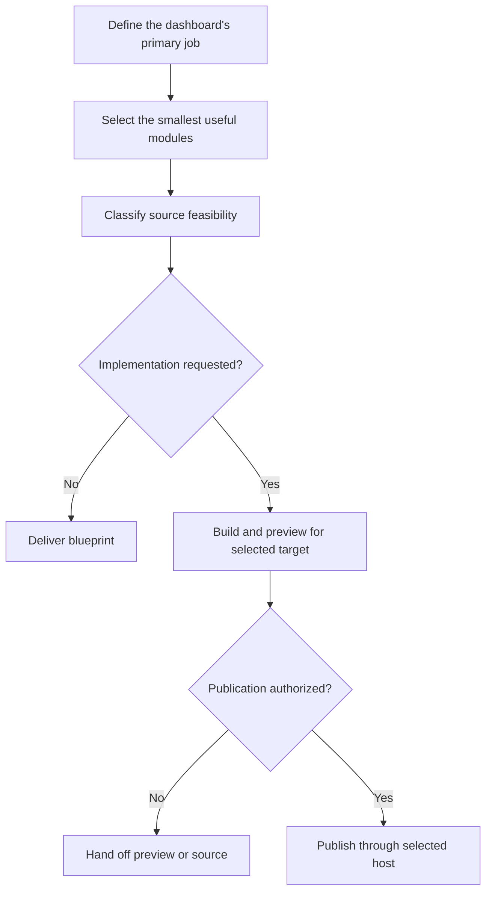

# Scaffold Personal Dashboard Site

A reusable Agent Skill for designing, scaffolding, or extending a modular personal dashboard for GPT Sites, Claude Code, or Claude Artifacts. It creates an opinionated working foundation that can become a daily brief, personal command center, creator hub, job-search workspace, or another focused personal tool without cloning one person's implementation.

The skill concentrates on the decisions that make dashboards useful and reliable: what belongs in the first viewport, how modules compose, whether a data source is actually available to deployed Site code, what happens when one source fails, and when publication is authorized.

## When to use it

Use the skill when someone asks to:

- scaffold a personal dashboard or command center for GPT Sites or Claude
- create a daily brief from selected modules
- build a configurable dashboard that can grow over time
- add a modular source to an existing personal dashboard
- plan a dashboard before deciding which integrations are feasible

Do not use it for an ordinary marketing website, a static report, an enterprise analytics or BI platform, a generic admin portal, or a broad “build me a website” request. Use the normal Sites workflow directly for those experiences.

## Modes

| Mode | Starting point | Outcome |
| --- | --- | --- |
| **Blueprint** | Goal, module ideas, or an early concept | Read-only module map, source feasibility, shared-shell design, risks, and implementation plan |
| **Scaffold** | A request for a new dashboard | A working dashboard foundation for the selected target with requested modules and honest source states |
| **Extend** | An existing dashboard Site or repository | A focused module or foundation change that preserves established behavior and design |

When implementation intent is unclear, Blueprint is the safe default. A direct request to create or build selects Scaffold; an existing implementation selects Extend.

## Workflow



### Discover the first version

The agent identifies the person using the dashboard, the primary decision or action, the information that must appear immediately, timezone and freshness expectations, requested data sources, external actions, privacy, and publishing intent. It asks only questions that materially change the result.

The output is intentionally smaller than a universal portal. Optional modules are included only when they support the dashboard's primary job.

### Verify sources

Every source is classified as local/static, Sites storage, public HTTP, authenticated runtime API, or blocked. The agent verifies how deployed Site code will access live data before promising an integration.

This distinction is essential: a ChatGPT connector available during a conversation is not automatically an API or credential available to the published Site. Unsupported sources receive an honest configuration-required or blocked state rather than simulated live data.

### Build the working surface

For Scaffold and Extend, the skill selects a delivery target first. GPT Sites uses the installed Sites workflow; Claude Code creates a standalone repository app; Claude Artifacts creates an interactive artifact in Claude chat. The dashboard opens on its working surface rather than a marketing hero.

The shared shell handles identity, navigation, layout, configuration access, refresh coordination, source health, and consistent interaction behavior. Individual modules own provider-specific fetching, presentation, and local states. A failed source cannot erase successful modules.

### Preview and publish

The skill shows a meaningful preview and exercises relevant validation scenarios. Scaffolding alone does not silently authorize publication. When publishing is explicitly requested and the target is clear, the skill uses the selected hosting or sharing workflow instead of duplicating deployment mechanics.

## Dashboard foundation

The generated structure is adaptable rather than fixed. It provides boundaries for:

| Area | Foundation behavior |
| --- | --- |
| Shared shell | Dashboard identity, responsive layout, navigation, configuration, and refresh coordination |
| Module registry | Stable composition without provider logic in the shell |
| Source adapters | Provider-specific access, validation, and safe error classification |
| Module state | Loading, empty, disconnected, stale, refreshing, success, and error behavior |
| Freshness | Last successful refresh and trustworthy stale-data handling |
| Failure isolation | One dependency failure does not blank unrelated content |
| Configuration | Selectable accounts, channels, repositories, calendars, views, or feeds when supported |
| Privacy | Explicit audience and sensitivity boundaries with server-side secrets |
| Accessibility | Responsive layout, keyboard operation, readable text, and visible focus |

The skill does not require drag-and-drop composition, dynamic plugin loading, queues, databases, or background workers unless selected modules demonstrate a need for them.

## Optional modules

Email, calendar, tasks, GitHub, Notion, YouTube, RSS, weather, jobs, bookmarks, and custom APIs are examples rather than a default bundle. A dashboard may begin with only local focus items and links, or with a few verified live sources.

When a provider offers multiple accounts or collections, the dashboard should expose an appropriate selection instead of hard-coding the first accessible result. Read access never implies authorization to send messages, complete tasks, modify repositories, purchase items, or mutate third-party data.

## Approval and execution boundaries

Blueprint is read-only. Scaffold and Extend authorize only the requested workspace or repository changes. Separate authorization may be required for:

- GitHub commits, branches, or pull requests
- connector or OAuth authorization
- credential creation and API enablement
- storage or infrastructure provisioning
- paid services or metered model/API usage
- writes to third-party systems
- destructive migrations
- Publication or deployment

An explicit request to publish or deploy can authorize the named Sites target. Otherwise the skill stops with the completed preview or source and asks before hosting. It never treats silence as approval.

## Included resources

| Resource | Purpose |
| --- | --- |
| `SKILL.md` | Mode selection, core workflow, Sites orchestration, approval boundaries, and completion criteria |
| `references/dashboard-foundation.md` | Shared shell, module contracts, refresh, configuration, first viewport, and evolution seams |
| `references/source-integrations.md` | Runtime feasibility, authentication, account selection, failures, privacy, and mutations |
| `references/validation-scenarios.md` | Foundation, source, resilience, accessibility, and publication scenarios |
| `references/delivery-targets.md` | Target-specific execution, prerequisites, publication, and portability |
| `agents/openai.yaml` | OpenAI-facing name, description, invocation example, and automatic-selection policy |

The skill contains no full generated application. It uses the selected platform’s current starter or native artifact format. Dashboard-specific structure is generated from the maintained contracts in this skill.

## Validation

From the repository root, run:

```bash
python scripts/validate_repository.py
```

For a behavioral forward test, use temporary data and representative prompts from `references/validation-scenarios.md`. At minimum, test a local-only dashboard, an authenticated source request, an isolated source failure, and the publication boundary.

Repository validation checks skill packaging, frontmatter, catalog links, Python syntax, and Markdown newline safety. It does not prove that a live provider is reachable, credentials have appropriate scopes, a generated dashboard is accessible, or a deployed Site protects private data. Those require target-specific manual or integration checks.

## Installation

Keep the complete directory together so its references remain available.

### ChatGPT Work

Use the complete skill-directory URL for the current task:

```text
Use the scaffold-personal-dashboard-site skill from this directory:
https://github.com/vladicaster/agent-skills/tree/main/engineering/scaffold-personal-dashboard-site
```

Install it through a supported Skills or plugin workflow for reusable availability, then invoke it with `@scaffold-personal-dashboard-site`.

Sites skills are required only for the GPT Sites delivery target. Connections, credentials, and runtime permissions are configured separately.

### Codex

- Personal: `~/.agents/skills/scaffold-personal-dashboard-site/`
- Project: `.agents/skills/scaffold-personal-dashboard-site/`
- Invocation: `$scaffold-personal-dashboard-site`

Codex can produce a Blueprint or standalone repository implementation without Sites tooling. Native previews and publication require the selected target’s capabilities.

### Claude Code

- Personal: `~/.claude/skills/scaffold-personal-dashboard-site/`
- Project: `.claude/skills/scaffold-personal-dashboard-site/`
- Invocation: `/scaffold-personal-dashboard-site`

Claude Code builds and previews a standalone dashboard using the project’s framework and commands. It does not require GPT Sites; deployment uses an explicitly selected provider.

### Claude chat and Artifacts

Load the complete skill through the current supported custom-skill workflow, or supply SKILL.md and its referenced files in the conversation. A GitHub URL alone does not prove that Claude loaded every file. Request: “Use scaffold-personal-dashboard-site to create a Claude Artifact dashboard with bookmarks and focus items. Preview only.”

Artifacts do not require a Git repository. Check the current plan, enabled capabilities, native integration APIs, and audience before promising persistence or sharing. If this host cannot execute Artifacts, deliver source and a Claude handoff prompt and report native execution as not run.

## Delivery targets

| Target | Output | Preview and publication |
| --- | --- | --- |
| GPT Sites | Sites project using the current supported starter | Sites preview and authorized hosting |
| Claude Code | Standalone app with module adapters and documented run/build commands | Local app preview; authorized provider deployment |
| Claude Artifacts | Self-contained HTML/React artifact with target-supported modules | Native artifact preview; authorized plan-appropriate sharing |

See [delivery-targets.md](references/delivery-targets.md) for capability checks, storage boundaries, handoff instructions, and current official documentation. The skill ID remains unchanged for compatibility. Source contracts are portable; authentication, storage, and hosting adapters require revalidation when moving targets.

## Limitations

- The skill is a dashboard foundation, not a universal personal operating system or enterprise BI platform.
- It does not make conversation-time connectors available to deployed Site code.
- It does not supply provider accounts, OAuth clients, API keys, or paid services.
- It does not guarantee live integration feasibility before the target runtime and provider path are verified.
- It does not publish or expose private data without the applicable authorization.
- Installed copies are snapshots and do not automatically receive source updates.

## Updating this skill

Installed copies do not automatically follow `main`.

- **ChatGPT Work:** Ask ChatGPT to update the installed skill from `https://github.com/vladicaster/agent-skills/tree/main/engineering/scaffold-personal-dashboard-site`, review meaningful workflow or permission changes, and replace the complete directory.
- **Codex or Claude Code, symbolic link:** Pull the source checkout deliberately.
- **Codex or Claude Code, copied directory:** Pull the source, compare local customizations, and copy the complete skill again.
- **Pinned installation:** Use a Git tag when reproducibility matters and upgrade deliberately.

See the repository-wide versioning policy in [the root README](../../README.md#versioning-and-updates).
