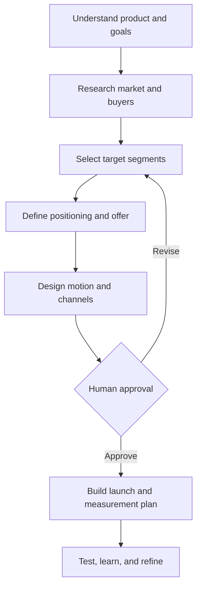

# Develop Go-to-Market Strategy

A reusable Agent Skill for turning a product idea, PRD, website, pitch deck, customer evidence, existing strategy, or market results into an evidence-based go-to-market plan.

It connects market selection, product readiness, positioning, offer design, distribution, sales, customer success, launch execution planning, and measurement.

## How it works



## Modes

| Mode | Starting point | Outcome |
| --- | --- | --- |
| Discover | Product idea or PRD | Initial commercialization hypothesis |
| Develop | Product plus business context | Complete GTM strategy |
| Audit | Existing strategy | Strengths, gaps, contradictions, and risks |
| Refine | Strategy plus new information | Targeted strategic revision |
| Launch | Approved strategy | Phased launch plan and readiness checklist |
| Diagnose | Weak funnel or revenue performance | Root-cause analysis and prioritized experiments |
| Reconcile | Strategy plus actual results | Evidence-based strategy update |

## Step by step

1. **Establish the decision context:** Product maturity, business model, geography, revenue objective, timeline, team, budget, capacity, and success criteria.
2. **Gather and classify evidence:** Separate verified external evidence, company-provided facts, inference, and untested assumptions.
3. **Assess market readiness:** Evaluate the problem, product, buyer, proof, delivery capacity, offer, and measurement.
4. **Research the market:** Analyze category language, competitors, alternatives, substitutes, buyer behavior, and relevant constraints.
5. **Select segments:** Score candidates and recommend a beachhead, secondary segment when justified, and deferred segments.
6. **Define the buying system:** Establish the ICP, users, buyers, evaluators, influencers, blockers, triggers, objections, and decision criteria.
7. **Develop positioning:** Define the category, differentiated promise, reason to believe, proof, narrative, and objection handling.
8. **Design the offer:** Develop packaging, pricing hypotheses, entry offer, trial/demo/pilot, onboarding, time to value, retention, and expansion.
9. **Choose the motion and channels:** Recommend and prioritize the sales motion and distribution channels with stop/scale thresholds.
10. **Identify readiness gaps:** Classify product and business gaps as blockers, near-term requirements, experiments, later enhancements, or unjustified.
11. **Obtain approval:** Present the strategy for approval, revision, or cancellation.
12. **Build the plan:** Produce launch phases, experiments, measures, owners, dependencies, assets, assumptions, and 30/60/90-day priorities.

## What it addresses

| Area | Output |
| --- | --- |
| Market definition | Category, boundaries, trends, alternatives, and reachable opportunity |
| Segmentation | Ranked customer segments and explicit deferrals |
| ICP and buying group | Customer attributes, users, buyers, evaluators, influencers, and blockers |
| Problem validation | Importance, urgency, frequency, and current workaround |
| Competitive landscape | Direct competitors, indirect alternatives, substitutes, and differentiation |
| Product readiness | Launch blockers and product gaps |
| Positioning | Category, promise, differentiation, reasons to believe, and proof |
| Messaging | Core narrative, segment messages, claims, and objections |
| Offer and packaging | Plans, bundles, trial/demo/pilot, risk reversal, and expansion path |
| Pricing | Value metric, pricing hypotheses, willingness-to-pay evidence, and validation |
| Sales motion | Founder-led, PLG, sales-led, partner-led, community-led, content-led, marketplace-led, or hybrid |
| Channels | Ranked acquisition and distribution channels with metrics and thresholds |
| Funnel | Awareness, acquisition, activation, conversion, retention, and expansion |
| Sales readiness | Qualification, demo, collateral, objections, proof, and handoffs |
| Customer success | Onboarding, first value, adoption, support, retention, and expansion |
| Partnerships | Partner types, incentives, enablement, and mutual value |
| Launch | Phases, assets, dependencies, owners, readiness, and decision gates |
| Economics | Revenue model, margin, CAC hypotheses, payback, and capacity constraints |
| Measurement | KPIs, instrumentation gaps, experiment design, and learning cadence |
| Risks | Market, product, credibility, channel, operational, and financial risks |
| Roadmap | Prioritized 30/60/90-day plan |

## Strategy deliverables

An approved engagement can produce:

```text
gtm-strategy/
├── executive-summary.md
├── market-readiness.md
├── segments-and-icp.md
├── positioning-and-messaging.md
├── offer-and-pricing.md
├── motions-and-channels.md
├── product-and-business-gaps.md
├── launch-plan.md
├── measurement-plan.md
└── experiments.md
```

The skill creates only useful deliverables; it does not mechanically generate every file.

## Approval and execution boundary

The skill develops strategy, plans, recommendations, and draft assets. It requires separate authorization before contacting prospects, sending email, posting publicly, buying media, changing production pricing, editing a live website, updating a CRM, creating external accounts, or committing to a partner.

## Included resources

- Market-readiness, segmentation, positioning, pricing, channel, launch, and measurement guidance.
- A deterministic segment-scoring utility.
- Templates for a complete strategy, segment scorecard, experiment card, and launch plan.

## Installation

Keep the complete directory together.

- **ChatGPT Work:** Install through a supported Skills workflow or an OpenAI plugin. Invoke with `@develop-go-to-market-strategy`.
- **Codex personal:** `~/.agents/skills/develop-go-to-market-strategy/`
- **Codex project:** `.agents/skills/develop-go-to-market-strategy/`
- **Claude Code personal:** `~/.claude/skills/develop-go-to-market-strategy/`
- **Claude Code project:** `.claude/skills/develop-go-to-market-strategy/`

Invoke with `$develop-go-to-market-strategy` in Codex or `/develop-go-to-market-strategy` in Claude Code.

Installing the skill does not grant research subscriptions, CRM, email, advertising, website, analytics, or other external access.
