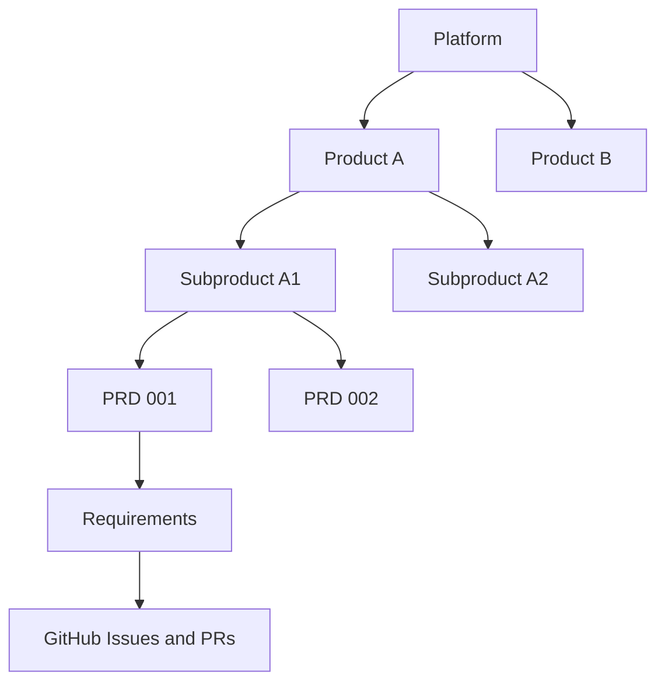
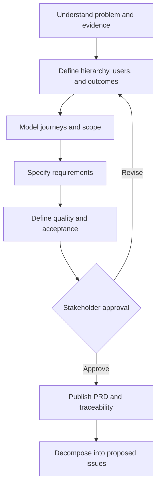
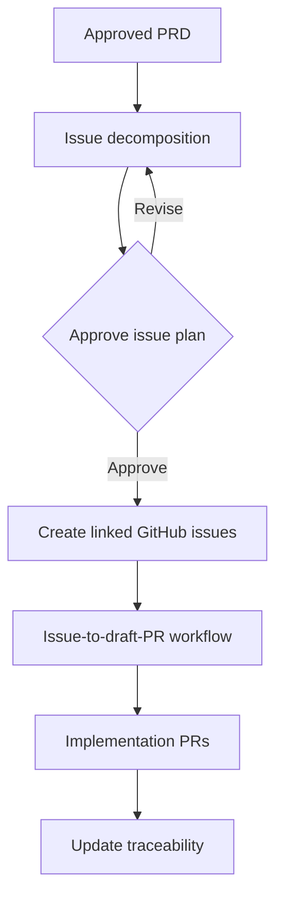

# Develop Product Requirements

A reusable Agent Skill for creating and managing decision-ready product requirements across complex platforms.

It explicitly supports:

- One platform with multiple products.
- Products with multiple subproducts.
- Multiple PRDs at the appropriate product, subproduct, or feature level.
- One PRD decomposed into multiple GitHub issues.
- One requirement implemented by multiple issues.
- One issue satisfying multiple related requirements.
- PRDs and issues spanning multiple repositories.
- Traceability from evidence through requirements, issues, pull requests, tests, and acceptance.

## Requirements hierarchy



Shared requirements should live at the highest valid level. Feature PRDs inherit applicable platform, product, and subproduct requirements instead of copying them.

## Modes

| Mode | Outcome |
| --- | --- |
| Discover | Structured product concept and missing decisions |
| Develop | Complete decision-ready PRD |
| Audit | Quality, ambiguity, completeness, and risk assessment |
| Refine | Improved requirements using feedback or evidence |
| Change | Impact-analyzed revision with preserved history |
| Decompose | Proposed delivery slices and GitHub issue plan |
| Reconcile | Requirements aligned with actual evidence and implementation |
| Validate | Read-only hierarchy, content, and traceability assessment |

## How it works



### Step by step

1. **Locate the product:** Identify the platform, product, subproduct, feature, owners, and existing PRDs.
2. **Gather evidence:** Separate verified evidence, company facts, stakeholder decisions, inference, assumptions, and open questions.
3. **Define the problem:** Establish users, current behavior, impact, importance, evidence, and why the work matters now.
4. **Define outcomes:** State user, product, and business outcomes plus measurable indicators without inventing targets.
5. **Model journeys:** Cover primary, alternate, failure, recovery, permission, and operational scenarios.
6. **Set scope:** Distinguish required, desirable, optional, deferred, excluded, and unresolved work.
7. **Write requirements:** Create stable, traceable functional and nonfunctional requirement identifiers.
8. **Define acceptance:** Write testable acceptance criteria covering behavior, boundaries, failures, permissions, accessibility, analytics, and compatibility where applicable.
9. **Address completeness:** Evaluate UX, data, integrations, security, privacy, observability, rollout, support, dependencies, risks, and migration.
10. **Build traceability:** Map evidence to outcomes, requirements, acceptance criteria, issues, PRs, tests, and validation evidence.
11. **Obtain approval:** Present the PRD for approval, revision, deferral, or cancellation.
12. **Decompose:** Propose independently deliverable issues and check that every approved requirement is covered.

## What it addresses

| Area | Output |
| --- | --- |
| Product hierarchy | Platform, product, subproduct, PRD ownership, and inherited requirements |
| Stable identity | Persistent identifiers for PRDs, requirements, metrics, and acceptance criteria |
| Problem and evidence | User problem, alternatives, severity, evidence, assumptions, and open questions |
| Users and stakeholders | Actors, goals, permissions, buyers, operators, support, and decision owners |
| Outcomes | User, product, and business results plus measurement requirements |
| Journeys | Primary, alternate, failure, recovery, and operational paths |
| Scope | Included, prioritized, deferred, excluded, and unresolved work |
| Functional requirements | Testable behavior with rationale, priority, dependencies, and source |
| Nonfunctional requirements | Applicable performance, security, privacy, accessibility, resiliency, compatibility, scale, and supportability |
| UX and accessibility | Interaction, content, device, theme, keyboard, and assistive-technology needs |
| Data and integrations | Ownership, sources, destinations, retention, authentication, failures, events, and compatibility |
| Analytics | Events, measures, properties, privacy, ownership, and instrumentation gaps |
| Acceptance criteria | Verifiable outcomes, edge cases, failure behavior, and evidence |
| Dependencies and risks | Internal, external, legal, operational, product, and technical dependencies |
| Rollout | Flags, pilots, migration, monitoring, support readiness, rollback, and exit criteria |
| Issue decomposition | Deliverable slices, repositories, dependencies, validation, and proposed GitHub issues |
| Change management | Impact analysis, decision history, supersession, and versioning |
| Traceability | Evidence → outcome → requirement → acceptance → issue → PR → test → validation |

## One PRD to multiple GitHub issues



Issue creation is a separate approval boundary. The PRD skill proposes the full issue plan and coverage map; an authorized GitHub workflow creates the issues and manages implementation.

PRD authoring and issue planning do not require GitHub or an existing repository. Before approved issues are created, confirm every destination repository exists, its personal or organization ownership is correct, the authenticated identity has issue-creation access, and issues are enabled. If a required repository does not exist, stop and obtain separate authorization for repository creation or select another destination. See [GitHub and repository readiness](../../docs/github-repository-readiness.md).

Each issue should reference the PRD ID, requirement IDs, acceptance criteria, scope, dependencies, and validation expectations.

## Recommended artifact structure

```text
product-requirements/
├── product-catalog.yaml
├── platform/
│   ├── PLATFORM.md
│   └── shared-requirements.md
└── products/
    └── product-name/
        ├── PRODUCT.md
        └── subproducts/
            └── subproduct-name/
                ├── SUBPRODUCT.md
                └── prds/
                    └── PRD-EXAMPLE-001/
                        ├── PRD.md
                        ├── prd.yaml
                        ├── traceability.yaml
                        └── change-impact.md
```

A smaller feature can use one `PRD.md`. The skill scales the structure to the product’s complexity instead of imposing a portfolio layout universally.

## PRD versus technical design

The PRD states what must be true and why. It may preserve hard constraints such as an existing identity provider, cloud boundary, API contract, required browser, or compliance rule.

It does not independently select frameworks, databases, deployment topology, service boundaries, class structure, or detailed implementation. Those decisions belong in architecture and coding-harness work.

## Included resources

- Product hierarchy, evidence, journey, requirements, acceptance, prioritization, issue-decomposition, traceability, and change-management guidance.
- PRD, metadata, catalog, requirement, traceability, and change-impact templates.
- Deterministic validators for PRD structure, hierarchy, identifiers, and issue coverage.

## Installation

- **ChatGPT Work:** Install through a supported Skills workflow or OpenAI plugin; invoke with `@develop-product-requirements`.
- **Codex personal:** `~/.agents/skills/develop-product-requirements/`
- **Codex project:** `.agents/skills/develop-product-requirements/`
- **Claude Code personal:** `~/.claude/skills/develop-product-requirements/`
- **Claude Code project:** `.claude/skills/develop-product-requirements/`

Invoke with `$develop-product-requirements` in Codex or `/develop-product-requirements` in Claude Code.

Installing the skill does not grant GitHub, repository, analytics, customer-data, or stakeholder access.

## Updating this skill

Installed copies are snapshots and do not automatically follow source changes.

- **ChatGPT Work:** Ask ChatGPT: `Update my installed develop-product-requirements skill from https://github.com/vladicaster/agent-skills/tree/main/product/develop-product-requirements`. The update should retrieve and validate the complete directory, report meaningful changes or local conflicts, and replace the installed copy. Refresh or reopen the Skills page if necessary.
- **Codex or Claude Code, symbolic link:** Run `git -C /path/to/agent-skills pull`. The linked installation then uses the updated checkout.
- **Codex or Claude Code, copied directory:** Pull the source repository, compare any local customizations, and copy the complete skill directory into the personal or project skills location again.
- **Pinned installation:** Use a Git tag rather than `main` when reproducibility matters, and move to a newer tag deliberately.

See the repository's [versioning and update policy](../../README.md#versioning-and-updates) for release guidance.
