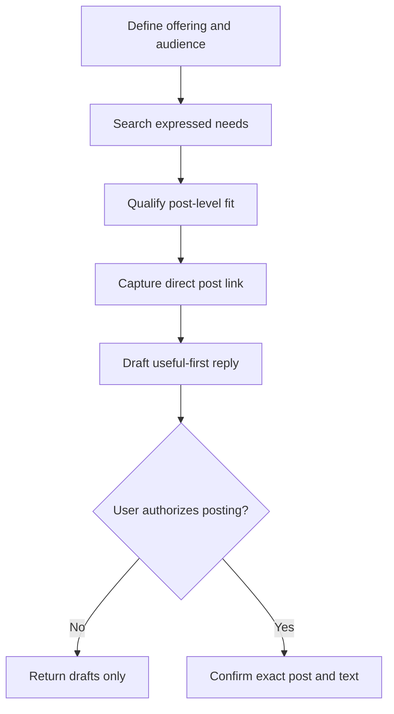

# Find LinkedIn Conversation Opportunities

A reusable Agent Skill for locating current LinkedIn posts where a product, service, or area of expertise can genuinely help, then turning those posts into evidence-based, useful-first engagement opportunities.

The skill is designed for founder-led social selling, thoughtful business development, partnership discovery, and post-led prospecting. It prioritizes relevance and conversation quality over outreach volume.

## When to use it

Use this skill when you want to:

- find LinkedIn posts that reveal an active customer or business problem;
- identify business owners or decision-makers whose current situation fits an offering;
- distinguish direct prospects from potential partners and general conversations;
- understand the concrete benefit the offering could provide;
- obtain the direct permalink to each post; or
- draft a relevant public reply without turning the comment into an unsolicited advertisement.

Do not use it for bulk lead scraping, automated comments, repetitive promotional replies, connection-spam campaigns, or engagement manipulation.

## How it works



## Workflow

1. Establish the offering, target customer, strongest supported benefits, and intended next step.
2. Search current LinkedIn posts for launches, booking announcements, recurring customer questions, objections, conversion problems, discoverability needs, service explanations, and complementary professional viewpoints.
3. Reject superficial keyword matches and posts where a product mention would hijack the conversation.
4. Classify credible results as direct prospects, potential partners, conversation-only opportunities, or unsuitable.
5. Explain the specific benefit using evidence from the post.
6. Capture the actual post permalink. If a search result does not expose it, use LinkedIn's **Copy link to post** control. Never present a profile or search page as a direct post URL.
7. Draft a unique comment that addresses the post first. Avoid product links and immediate offers unless the poster explicitly invites them.
8. Rank the strongest opportunities and return the drafts without posting them.

## Expected output

For every recommended post, the skill returns:

| Field | Meaning |
| --- | --- |
| Direct post link | Verified permalink to the specific LinkedIn post |
| Poster | Person or organization responsible for the post |
| Post signal | The expressed need, launch, question, or problem |
| Relationship type | Direct prospect, potential partner, or conversation only |
| Benefit | The concrete way the supplied offering could help |
| Suggested reply | A distinct, useful-first public comment |
| Confidence | Strength of the evidence and any unresolved facts |

## Engagement approach

The default public comment contributes an observation or question without linking to the user's product. If the poster responds positively, a later reply can disclose the relevant offering and ask whether a concrete example would be useful.

This two-stage approach reduces spam risk and produces a more natural conversation. It is a default, not a prohibition: a product mention can be appropriate when the original post directly discusses that solution category and the disclosure adds substance.

## Approval and execution boundary

The skill may search, assess, rank, and draft. It does not post comments, react, follow, connect, send messages, submit forms, or perform other representational actions without explicit authorization immediately before the action.

LinkedIn access must be configured separately. The skill must not use unauthorized automation for engagement or claim that drafted replies were posted. Platform policies can change, so current official rules should be checked when policy compliance or account risk is part of the request.

## Installation

For immediate use in a ChatGPT Work conversation:

```text
Use the find-linkedin-conversation-opportunities skill from this directory:
https://github.com/vladicaster/agent-skills/tree/main/product/find-linkedin-conversation-opportunities
```

Referencing the directory applies it to the current conversation; it does not permanently install the skill.

- **ChatGPT Work:** Install through a supported Skills workflow or plugin and invoke with `@find-linkedin-conversation-opportunities`.
- **Codex personal:** Copy or link the directory to `~/.agents/skills/find-linkedin-conversation-opportunities/`.
- **Codex project:** Copy or link it to `.agents/skills/find-linkedin-conversation-opportunities/`.
- **Claude Code personal:** Copy or link it to `~/.claude/skills/find-linkedin-conversation-opportunities/`.
- **Claude Code project:** Copy or link it to `.claude/skills/find-linkedin-conversation-opportunities/`.

Invoke with `$find-linkedin-conversation-opportunities` in Codex or `/find-linkedin-conversation-opportunities` in Claude Code.

GitHub is not required to run the skill. LinkedIn access is conditional on the host's available authenticated browsing capabilities. Drafts can still be created from post text and URLs supplied by the user.

## Validation

From the repository root, run:

```bash
python scripts/validate_repository.py
```

The validator checks repository structure, skill metadata, catalog consistency, and common Markdown problems. It does not prove that a LinkedIn result is current, that a prospect will respond, or that a comment complies with every future platform-policy change.

## Updating this skill

Installed copies are snapshots unless intentionally linked to a checkout.

- **ChatGPT Work:** Ask ChatGPT to update the skill from the source directory URL above.
- **Linked Codex or Claude installation:** Pull the source repository.
- **Copied installation:** Pull the repository, review the changes, and copy the complete directory again.
- **Pinned installation:** Use an explicit Git tag and update deliberately.

See the repository's [versioning and update policy](../../README.md#versioning-and-updates).

## Limitations

- Search quality depends on live LinkedIn access and the account's visible results.
- Search cards may omit direct permalinks, requiring the post-menu copy action.
- A relevant post is not proof of buying intent.
- Public engagement should remain manual, selective, personalized, and subject to the user's final approval.
