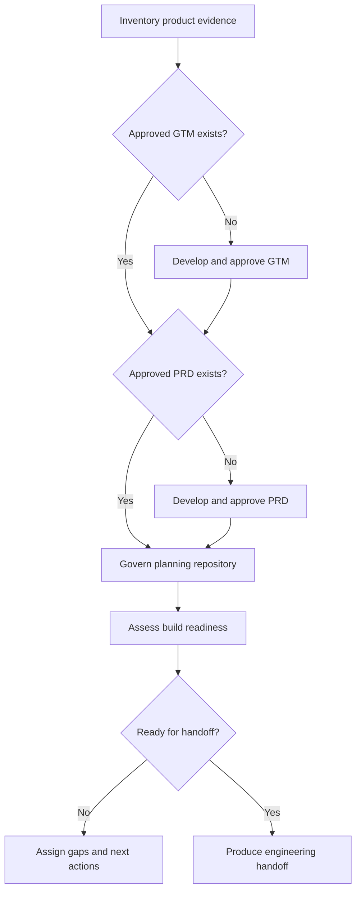

# Prepare Product for Engineering

A reusable Agent Skill for turning a product concept, partial plan, or approved product documentation into a governed, traceable engineering-readiness package before solution design or implementation begins.

It can optionally coordinate [`develop-go-to-market-strategy`](../develop-go-to-market-strategy/) and [`develop-product-requirements`](../develop-product-requirements/), then adds evidence governance, planning-repository structure, readiness classification, dependency compatibility, and a controlled engineering handoff. The GTM and PRD skills remain independently usable.

## When to use it

Use this skill when:

- a new product concept needs GTM validation and product requirements before engineering
- GTM or PRD work exists but the other stage is missing
- approved GTM and PRD documents need to be organized and assessed for build readiness
- product evidence, strategy, or requirements changed and downstream artifacts may need reconciliation
- engineering needs a controlled handoff that distinguishes approved inputs from unresolved decisions

Do not use it merely to write code, select a technology stack, create implementation issues, or install a coding-agent harness. Those are later workflows requiring separate authorization.

## Optional orchestration

Choose the smallest path needed:

| Starting point | What the skill does |
| --- | --- |
| Product concept or unstructured evidence | Orchestrates GTM, obtains approval, then orchestrates PRD development |
| Approved GTM but no approved PRD | Reuses GTM and invokes only the PRD skill |
| Approved PRD with compatible GTM evidence | Reuses the PRD and invokes GTM only when market validation is missing or materially stale |
| Approved GTM and PRD | Does not recreate them; proceeds to governance, readiness, reconciliation, or handoff |
| Assessment or repository setup only | Performs only the requested read-only assessment or planning-repository bootstrap |

Existing approval remains valid unless provenance is missing, evidence materially changed, or GTM and PRD decisions conflict.

## How it works



## Modes

| Mode | Starting point | Outcome |
| --- | --- | --- |
| **Assess** | Existing evidence, GTM, PRD, or planning repository | Readiness status, gaps, conflicts, owners, and next actions |
| **Prepare** | Product concept or partial documentation | Approved GTM and PRD path plus a governed readiness package |
| **Bootstrap** | Approved or draft planning artifacts without a repository structure | Standard planning-repository layout and navigation |
| **Reconcile** | Changed evidence, GTM, PRD, or implementation learning | Impact analysis and aligned artifacts without erasing history |
| **Handoff** | Approved GTM and PRD plus readiness evidence | Controlled package for architecture and engineering planning |

Assess is read-only unless the user separately authorizes repository changes. Prepare, Bootstrap, Reconcile, and Handoff identify their exact proposed writes before making them.

## Step by step

1. **Establish the decision context:** Identify the product boundary, business objective, owners, target decision, timing, requested mode, and confidentiality constraints.
2. **Inventory sources:** Locate product evidence, research, decks, business plans, GTM material, PRDs, decisions, and related repository artifacts.
3. **Classify evidence:** Separate facts, external evidence, company-provided information, inference, assumptions, decisions, and unknowns while preserving provenance.
4. **Select the dependency path:** Determine whether GTM and PRD work should be reused, reconciled, or created through their owning skills.
5. **Validate GTM:** When needed, invoke the current GTM skill and preserve its approval, revision, or cancellation gate.
6. **Validate product requirements:** When needed, invoke the current PRD skill and preserve stable identifiers, hierarchy, traceability, acceptance criteria, and PRD approval.
7. **Govern the planning repository:** Organize sources, evidence, strategy, requirements, decisions, and readiness records without presenting derived files as untouched originals.
8. **Assess readiness:** Classify each material gate as Ready, Conditionally ready, Blocked, or Not assessed.
9. **Assign gaps:** Give every condition or blocker an owner, next action, and target date when known.
10. **Produce the handoff:** Summarize approved constraints, requirements, risks, dependencies, validation expectations, and unresolved decisions.
11. **Stop at the engineering boundary:** Ask for separate authorization before solution design, stack selection, harness creation, issue creation, or implementation.

## What it addresses

| Area | Output |
| --- | --- |
| Product boundary | Product, subproduct, intended outcome, owners, and decision scope |
| Evidence governance | Source inventory, provenance, classification, confidence, and open questions |
| GTM compatibility | Approved market, ICP, positioning, offer, channel, launch, and readiness decisions |
| PRD compatibility | Approved hierarchy, requirements, acceptance criteria, nonfunctional needs, and traceability |
| Cross-document alignment | Contradictions, stale assumptions, missing dependencies, and change impact |
| Decision governance | Decision log with status, rationale, evidence, owner, and revisit trigger |
| Repository governance | Stable planning structure, navigation, confidentiality expectations, and source separation |
| Build readiness | Gate-by-gate status with evidence, owner, next action, and overall classification |
| Engineering handoff | Approved inputs, hard constraints, risks, dependencies, validation expectations, and open decisions |
| Workflow boundary | Explicit separation between product preparation and engineering execution |

## Readiness model

Each material gate receives one of four states:

- **Ready:** approved and sufficient for engineering planning
- **Conditionally ready:** work may proceed only under recorded conditions
- **Blocked:** a material decision or dependency prevents handoff
- **Not assessed:** evidence is insufficient to classify

The overall state cannot exceed the weakest material gate. Readiness covers evidence quality, GTM approval, product boundary, PRD approval, traceability, nonfunctional requirements, risks and dependencies, validation planning, ownership, and handoff completeness.

## Planning-repository structure

A typical output is:

```text
product-planning/
├── README.md
├── sources/
├── research/
│   └── evidence-register.md
├── gtm/
├── requirements/
├── decisions/
│   └── decision-log.md
└── planning/
    └── build-readiness.md
```

The skill scales the structure to the product. It creates only useful artifacts, keeps original-source provenance visible, uses relative links, and never stores secrets.

## What it produces

Depending on the selected mode, an engagement can produce:

- evidence register and source inventory
- decision log
- approved GTM and PRD artifacts created by their owning skills
- governed planning-repository structure
- build-readiness assessment with owners and next actions
- reconciliation report for changed or conflicting inputs
- engineering handoff that separates approved inputs from open decisions

## Approval and execution boundaries

The skill preserves all approval gates required by the GTM and PRD skills. It does not treat silence as approval.

Separate authorization is required before:

- creating or changing a private or public GitHub repository
- uploading confidential source material
- choosing an architecture or technology stack
- creating or installing a coding-agent harness
- decomposing work into delivery issues when the PRD issue-plan gate has not been approved
- writing code, changing production systems, deploying, or contacting external parties

Repository privacy must be confirmed before confidential material is uploaded.

GitHub is optional. The planning package may remain local or use another approved document destination. If an existing repository is selected, confirm the authenticated identity, repository ownership and visibility, confidentiality compatibility, and required permissions. If no repository exists, continue with portable artifacts unless the user separately authorizes creation and specifies the personal or organization owner and public or private visibility. See [GitHub and repository readiness](../../docs/github-repository-readiness.md).

## Dependency updates

The orchestrator uses the installed or current versions of the GTM and PRD skills rather than copying their methodology.

- **Compatible change:** consume the updated output directly.
- **Additive change:** preserve new fields and update the orchestration mapping when useful.
- **Breaking change:** stop and propose a migration when approval semantics, traceability, identifiers, or required outputs are no longer compatible.

Reusable GTM or PRD methodology improvements belong upstream in their owning skill. Product-specific adaptations belong in the product planning repository.

## Included resources

| Resource | Purpose |
| --- | --- |
| `SKILL.md` | Modes, dependency routing, workflow, approval gates, and completion criteria |
| `references/dependency-contract.md` | Required GTM and PRD semantics plus compatibility rules |
| `references/planning-repository.md` | Recommended planning-repository organization and provenance rules |
| `references/readiness-model.md` | Readiness gates and canonical status definitions |
| `assets/evidence-register-template.md` | Evidence provenance and classification template |
| `assets/decision-log-template.md` | Decision status, rationale, ownership, and revisit template |
| `assets/build-readiness-template.md` | Gate-by-gate readiness assessment template |
| `scripts/validate_planning_repo.py` | Deterministic minimum-structure and readiness-state validator |

## Validation

Run:

```bash
python scripts/validate_planning_repo.py /path/to/planning-repository
```

The validator checks the minimum planning structure, presence of GTM and PRD Markdown, and canonical readiness states. It does not verify the truth of evidence or substitute for human approval.

Validation results should be reported as Passed, Failed, Blocked, Manual, or Not run.

## Installation

Keep the complete directory together so `SKILL.md`, `references/`, `assets/`, and `scripts/` remain available.

### ChatGPT Work

Install through a supported Skills workflow or an OpenAI plugin. Invoke with:

```text
@prepare-product-for-engineering
```

### Codex

- Personal: `~/.agents/skills/prepare-product-for-engineering/`
- Project: `.agents/skills/prepare-product-for-engineering/`

Invoke with:

```text
$prepare-product-for-engineering
```

### Claude Code

- Personal: `~/.claude/skills/prepare-product-for-engineering/`
- Project: `.claude/skills/prepare-product-for-engineering/`

Invoke with:

```text
/prepare-product-for-engineering
```

Install the GTM and PRD skills when you want this skill to invoke them. Without those dependencies, it can still assess supplied artifacts, organize a planning repository, classify readiness, and produce a handoff.

Installing this skill does not grant Google Drive, GitHub, repository, customer-data, research, or other external access. Configure those permissions separately.

## Updating this skill

Installed copies are snapshots and do not automatically follow source changes.

- **ChatGPT Work:** Ask ChatGPT: `Update my installed prepare-product-for-engineering skill from https://github.com/vladicaster/agent-skills/tree/main/product/prepare-product-for-engineering`. The update should retrieve and validate the complete directory, report meaningful changes or local conflicts, and replace the installed copy.
- **Codex or Claude Code, symbolic link:** Run `git -C /path/to/agent-skills pull`. The linked installation then uses the updated checkout.
- **Codex or Claude Code, copied directory:** Pull the source repository, compare local customizations, and copy the complete skill directory into the installation location again.
- **Pinned installation:** Use a Git tag rather than `main` when reproducibility matters.

See the repository's [versioning and update policy](../../README.md#versioning-and-updates) for release guidance.

## Limitations

- Readiness is an evidence-based decision aid, not a guarantee that implementation will succeed.
- The skill does not fabricate research, approvals, owners, deadlines, or acceptance evidence.
- It does not automatically invalidate approved work merely because an upstream skill changed.
- It does not replace architecture, coding-harness, issue-delivery, security-review, legal, privacy, or financial-review workflows.
