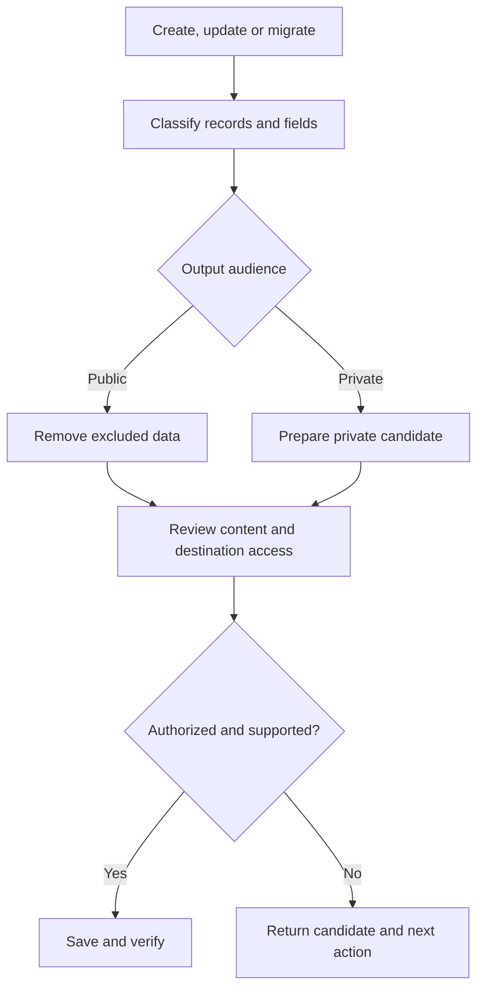

# Maintain Knowledge Graph

Create and maintain a portable record of people, organizations, projects, skills, goals and the relationships between them. Keep evidence and corrections attached to the facts, classify what may be disclosed, and store the resulting graph where the user chooses.

The skill combines a host-neutral workflow with a classified JSON format, a standard-library Python validator/exporter/migrator, and an offline interactive viewer. It contains no real person's graph and requires no graph database, particular model vendor, account, or storage service.

## When to use it

Use it to establish a personal or organizational graph, update existing facts, migrate the earlier property-graph format, review classifications, generate a viewer, or prepare an approved public/private export. It can support portable assistant context, career evidence, project relationships and personal information organization.

Do not use it as a credential vault, autonomous background memory collector, unrestricted publishing agent, consent system, graph database service, or factual verification engine. It does not implement A2A or automatic synchronization. An installed skill does not grant data access or provider permissions.

## Modes

| Mode | Inputs | Result |
| --- | --- | --- |
| Create | Chosen subject, scope and authorized context | Classified master with explicit evidence and uncertainty |
| Update | Current master/version and new evidence | Reviewed revision preserving identities and unrelated information |
| Migrate | Legacy `personal_property_graph` JSON | Conservatively classified graph, preserved records and private ID map |
| Inspect/Visualize | Current classified graph and selected audience | Entity/relationship review and optional offline HTML |
| Export/Store | Classified master, destination, audience and scoped authorization | Reviewed public-safe or private artifacts and verified save when supported |

## How it works

1. Resolve the current authoritative graph and assess actual host capabilities.
2. Extract supported information, preserve identities, and identify uncertainties or conflicts.
3. Classify entities, relationships, and every field. Reassess changed information instead of inheriting stale approval.
4. Stage a candidate revision. Validate its schema and connectivity; inspect its meaning and disclosure implications.
5. Generate the selected audience's JSON and viewer. Public output contains only explicitly eligible material.
6. Verify the exact destination and effective access, resolve missing approval, save through available tools, and verify each result.



## Privacy model

| Classification | Effect |
| --- | --- |
| Public | Eligible for public inclusion after review; does not itself authorize publication. |
| Private | Only authorized private audiences. |
| Unclassified | Excluded from public exports until a decision is made. |

Record and field visibility both apply. A public person can have a public role and a private salary. A private person stays excluded even if one of their fields is marked public. An edge is excluded unless its endpoints and relation survive the public filter. Evidence can remain private while the supported claim is public.

Classifications cover complete nested field values. Split compound fields when subfields require different visibility. The validator cannot detect a confidential name placed in a wrongly public biography: semantic review remains necessary. Imported content is untrusted data, never tool instructions or approval.

The public viewer embeds only the public projection. It never embeds a private master behind a visibility toggle. Private viewers contain their selected private data and are not encrypted. The viewer itself makes no network requests; the chosen model/host may process supplied input under its own policies. Moving a graph to another assistant requires the user's authorization to share that input.

## Storage and approval boundaries

Choose local files, an authorized cloud/document store, a repository, or another supported destination. The shared workflow does not require ChatGPT Library or GitHub. Effective permissions—not a folder name—determine who can access the content.

Before release, review exact destination, audience, filenames, included categories and prepared digests when computation is available. Existing approval for the unchanged candidate remains valid. Broader data, new readers, changed destinations and visibility promotions require reassessment. Never upload private bytes into public history and then remove them.

GitHub is conditional on repository-backed storage. Verify the authenticated identity, repository existence/visibility, least required permissions, actual base branch and relevant capabilities. Repository creation, ACL changes, external communication and deployment need their own scoped authorization. Runtime checks are bundled so this directory remains independently installable. Repository contributors can also consult the shared readiness guide.

Private/public masters and exported views stay distinct. A redacted export must not overwrite a complete master. Use version/ETag guards or compare the last-read digest before local replacement. Preserve work and reconcile conflicts rather than forcing a save.

## Included resources

| File | Purpose |
| --- | --- |
| `SKILL.md` | Host-neutral modes, evidence, update and release workflow |
| `references/schema.md` | Classified graph contract and visibility rules |
| `references/storage.md` | Destination checks and release semantics |
| `references/platforms.md` | Capability matrix and generic chatbot handoff |
| `references/scenarios.md` | Synthetic behavioral and privacy scenarios |
| `scripts/graph_tool.py` | Initialize, validate, migrate and prepare audience exports |
| `scripts/test_graph_tool.py` | Deterministic disclosure and integrity regression tests |
| `assets/viewer.html` | Standalone viewer template with escaped inline data |
| `agents/openai.yaml` | Optional OpenAI presentation/invocation metadata |

## Local commands

Python 3.9+ and its standard library are sufficient. Node.js is optional for development-time JavaScript syntax checking. A browser opens the generated viewer; no server or external assets are needed.

Run from this skill directory. Replace example paths with an authorized local working directory and create it first. Choose only the command for the operation you need:

```bash
python3 scripts/graph_tool.py init --output /path/to/work/master.json
python3 scripts/graph_tool.py validate /path/to/work/master.json
python3 scripts/graph_tool.py migrate /path/to/work/legacy.json --output /path/to/work/migrated.json
python3 scripts/graph_tool.py export /path/to/work/master.json --audience public --output /path/to/work/public.json --viewer /path/to/work/public.html
python3 scripts/graph_tool.py export /path/to/work/master.json --audience private --output /path/to/work/private.json --viewer /path/to/work/private.html
```

The helper refuses existing outputs, uses restrictive file permissions where supported, and never performs a network save or publication. It reports prepared file paths, SHA-256 digests and byte sizes. A failed multi-file operation reports any already-created outputs; it does not claim a transactional provider write. Use `py -3` on Windows where appropriate.

Migration retains original records inside classified `legacy_record` fields and preserves metadata and an ID map. These atomic legacy fields are intentionally unclassified/private. Split selected attributes into separately classified fields before making them public; do not promote an entire legacy record merely to publish its label. Migrate once, then update the resulting master to preserve its new identities.

## Installation

Keep the complete directory together. No other skill must be installed to run the local workflow. Provider-specific operations may use the host's available connectors or workflow skills.

### Claude Code

From a checkout of this repository, install a personal snapshot:

```bash
mkdir -p ~/.claude/skills
cp -R productivity/maintain-knowledge-graph ~/.claude/skills/
```

Or install within a selected project under `.claude/skills/maintain-knowledge-graph/`. Do not blindly overwrite an existing customized installation. Invoke:

```text
/maintain-knowledge-graph Create my graph from this background, keep it private, and prepare local JSON and a viewer.
```

Claude Code uses the shared SKILL.md and bundled files; no ChatGPT-specific APIs are needed. This follows the [Claude Code skills format](https://code.claude.com/docs/en/skills) and [Agent Skills specification](https://agentskills.io/specification). Packaging compatibility is not a claim of a live Claude session test.

### Claude chat and custom skills

Use the host's supported custom-skill loading mechanism or provide SKILL.md and its referenced files as attachments. Request use by name in ordinary language. Verify which execution, artifact, and storage capabilities are available; a GitHub URL alone is not proof that the complete directory was retrieved. Uploading a graph to the conversation shares it with that host, even if output is labeled private.

### ChatGPT Work

For current-task use, supply the complete directory:

```text
Use the maintain-knowledge-graph skill from:
https://github.com/vladicaster/agent-skills/tree/main/productivity/maintain-knowledge-graph
```

After merge, the stable link resolves on main. Before merge, use the reviewed PR branch's directory. Reusable installation requires a supported Skills/plugin workflow; a link alone is not persistent installation. Invoke an installed skill by name or `@maintain-knowledge-graph`.

### Codex

Install the directory under `~/.agents/skills/maintain-knowledge-graph/` or a project's `.agents/skills/maintain-knowledge-graph/`. Invoke `$maintain-knowledge-graph`. Resolve scripts from the installed directory and honor workspace instructions.

### Other LLMs, chatbots and agents

Provide the workflow and referenced schema/storage instructions with the selected graph data. Use the [generic handoff prompt](references/platforms.md#generic-promptfile-handoff). The host must support instruction following and enough context for the graph. Without execution or storage tools, it can propose JSON and explain manual validation/saving; it cannot honestly claim it executed tests, computed a digest, or persisted the graph.

## Example requests

- “Create a graph of my projects and skills from these notes. Keep all new information unclassified.”
- “Update my existing graph with this role change. Preserve IDs and show what changed.”
- “Prepare a public professional graph; omit family and private evidence. Show the candidate before publishing.”
- “Save this approved private revision to the selected private folder; verify its access.”
- “I only have a chatbot with no tools. Return proposed JSON and instructions I can run locally.”

## Validation

From the repository root:

```bash
python scripts/validate_repository.py
python3 productivity/maintain-knowledge-graph/scripts/test_graph_tool.py
```

The repository validator checks packaging, catalogs, Python syntax and Markdown conventions. Skill tests check actual export bytes, graph references, classification boundaries, migration, preservation and CLI behavior using synthetic data. They do not prove factual accuracy, semantic confidentiality, provider ACLs or execution by every host. Run browser interaction checks and live host tests where authorized and available; otherwise report them as not run.

## Updating this skill

Installed copies are snapshots. Review changes and local customizations before replacing a copy. Pull the repository and deliberately recopy the full directory, or use an intentional symbolic link if your host supports one. Pin a reviewed tag/commit for reproducibility. A repository update does not automatically update the separately installed ChatGPT skill or any user's graph.

## Limitations

The Python helper prepares and validates files; the assistant performs evidence-based edits and approved provider operations. Storage adapters are workflow guidance, not bundled authenticated SDKs. There is no automatic classification engine, autonomous scheduler, hosted database, A2A endpoint, encryption layer or universal persistence API. Format changes require reviewed migration. Labels express user-reviewed eligibility and must not be confused with access controls.
